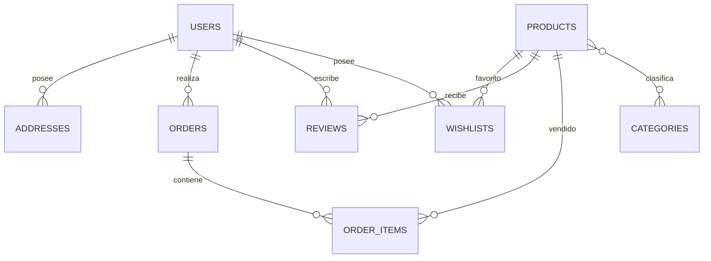

# 🗃️ Diagrama Entidad - Relación (DER)

> [!info]
> Documento perteneciente a la documentación técnica del proyecto **Rincón del Pan**.
>
> **Documentación relacionada**
> - [[README]]
> - [[01_Arquitectura]]
> - [[02_ModeloDominio]]
> - [[03_BaseDatos]]
> - [[07_UML]]

---

# Introducción

El Diagrama Entidad - Relación (DER) representa la estructura lógica de la base de datos utilizada por **Rincón del Pan**.

Su finalidad es describir las entidades que componen el sistema, sus atributos principales y las relaciones existentes entre ellas, proporcionando una visión completa del modelo de datos implementado.

El diseño del esquema busca mantener la integridad de la información, reducir la redundancia y facilitar la administración de los datos mediante **Eloquent ORM**.

---

# Objetivos

El DER permite:

- Representar gráficamente las entidades del sistema.
- Identificar las relaciones entre las tablas.
- Facilitar la comprensión del modelo de datos.
- Servir como referencia para el desarrollo y mantenimiento del proyecto.

---

# Entidades principales

El modelo de datos se encuentra compuesto por las siguientes entidades.

| Entidad | Descripción |
|----------|-------------|
| Users | Usuarios registrados en el sistema. |
| Addresses | Direcciones asociadas a los usuarios. |
| Categories | Clasificación de productos. |
| Products | Catálogo de productos. |
| Category_Product | Relación entre productos y categorías. |
| Orders | Pedidos realizados por los clientes. |
| Order_Items | Productos incluidos en cada pedido. |
| Reviews | Valoraciones de productos. |
| Wishlists | Productos favoritos de cada usuario. |

---

# Diagrama Entidad - Relación

> [!note]
> El diagrama representa las relaciones conceptuales implementadas por la aplicación. Los atributos específicos de cada entidad se describen en el apartado "Diccionario de Datos".

---

# Relaciones

## Usuario → Dirección

Un usuario puede registrar múltiples direcciones de entrega.

---

## Usuario → Pedido

Cada usuario puede realizar múltiples pedidos.

---

## Pedido → Detalle de Pedido

Cada pedido contiene uno o varios productos.

---

## Producto → Categoría

Los productos pueden pertenecer a una o varias categorías.

Del mismo modo, una categoría puede contener múltiples productos.

Esta relación se implementa mediante una tabla intermedia.

---

## Usuario → Wishlist

Cada usuario dispone de una lista de productos favoritos.

---

## Usuario → Reseñas

Los usuarios pueden publicar reseñas sobre distintos productos.

---

# Diccionario de Datos

El detalle completo de atributos se documentará en futuras versiones de este documento.

| Tabla | Descripción |
|---------|-------------|
| Users | Información de usuarios. |
| Addresses | Direcciones del cliente. |
| Categories | Categorías del catálogo. |
| Products | Productos disponibles. |
| Category_Product | Relación N:M entre productos y categorías. |
| Orders | Cabecera del pedido. |
| Order_Items | Detalle de cada pedido. |
| Reviews | Opiniones de usuarios. |
| Wishlists | Productos favoritos. |

---

# Integridad Referencial

La base de datos implementa integridad referencial mediante claves foráneas entre las distintas entidades.

Estas relaciones garantizan la consistencia de la información almacenada y evitan la existencia de registros huérfanos.

Las restricciones definidas permiten preservar la coherencia del modelo de datos durante las operaciones de inserción, actualización y eliminación.

---

# Resumen

El DER constituye la representación gráfica del modelo relacional de **Rincón del Pan**, mostrando las entidades principales del sistema y las relaciones que permiten soportar las funcionalidades implementadas por la aplicación.

Este documento complementa la descripción conceptual desarrollada en [[02_ModeloDominio]] y la organización general de la base de datos presentada en [[03_BaseDatos]].

---

## Documentación relacionada

- [[README]]
- [[01_Arquitectura]]
- [[02_ModeloDominio]]
- [[03_BaseDatos]]
- [[07_UML]]