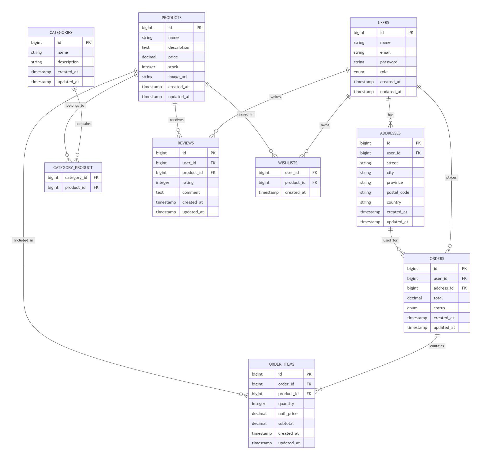

# DER - Rincón del Pan (E-commerce de Pastelería)

## Diagrama Entidad-Relación 

# Documentación de Entidades

## USERS
Almacena la información de autenticación y perfil de los usuarios del sistema.

Campos principales:
- id
- name
- email
- password
- role (admin o cliente)

Relaciones:
- Un usuario posee muchas direcciones.
- Un usuario puede realizar muchos pedidos.
- Un usuario puede crear muchas reseñas.
- Un usuario puede guardar muchos productos en favoritos.

---

## ADDRESSES
Almacena las direcciones de envío de cada cliente.

Relaciones:
- Pertenece a un usuario.
- Puede utilizarse en múltiples pedidos.

---

## CATEGORIES
Representa las categorías del catálogo.

Ejemplos:
- Tortas
- Tartas
- Cupcakes
- Cookies

Relaciones:
- Una categoría contiene muchos productos.
- Un producto puede pertenecer a varias categorías.

---

## PRODUCTS
Representa los productos comercializados.

Campos principales:
- name
- description
- price
- stock
- image_url

Relaciones:
- Pertenece a una o varias categorías.
- Puede estar presente en varios pedidos.
- Puede recibir reseñas.
- Puede guardarse en listas de deseos.

---

## CATEGORY_PRODUCT
Tabla pivote para implementar la relación muchos a muchos entre categorías y productos.

---

## ORDERS
Representa una compra realizada por un cliente.

Campos principales:
- total
- status
- user_id
- address_id

Estados permitidos:
- pendiente
- pagado
- enviado
- entregado
- cancelado

Relaciones:
- Pertenece a un usuario.
- Utiliza una dirección de envío.
- Contiene múltiples ítems.

---

## ORDER_ITEMS
Detalle de cada producto incluido dentro de un pedido.

Campos principales:
- quantity
- unit_price
- subtotal

Relaciones:
- Pertenece a un pedido.
- Referencia a un producto.

---

## REVIEWS
Permite registrar opiniones y puntuaciones de productos.

Campos principales:
- rating
- comment

Relaciones:
- Pertenece a un usuario.
- Pertenece a un producto.

---

## WISHLISTS
Tabla pivote utilizada para almacenar los productos favoritos de un usuario.

Relaciones:
- Usuario ↔ Producto.
- Relación muchos a muchos.

# Resumen de Relaciones

## Uno a Muchos (1:N)

- Users → Addresses
- Users → Orders
- Addresses → Orders
- Orders → OrderItems
- Products → OrderItems
- Users → Reviews
- Products → Reviews

## Muchos a Muchos (N:M)

- Categories ↔ Products
- Users ↔ Products (Wishlist)

# Equivalencia Laravel Eloquent

- User hasMany Address
- User hasMany Order
- User hasMany Review
- User belongsToMany Product (Wishlist)
- Product belongsToMany Category
- Product belongsToMany User (Wishlist)
- Product hasMany Review
- Product hasMany OrderItem
- Order belongsTo User
- Order belongsTo Address
- Order hasMany OrderItem
