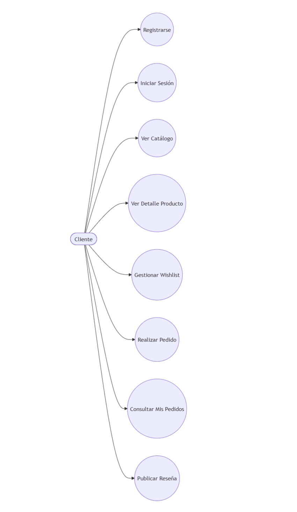
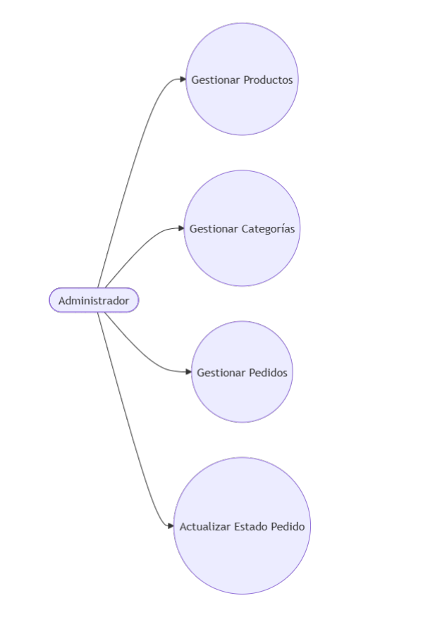

# Casos de Uso

# Sweet Store - E-commerce de Pastelería

## Objetivo

Este documento describe los principales casos de uso del sistema Sweet Store, identificando los actores involucrados y las funcionalidades que podrán realizar dentro de la aplicación.

---

# Actores

## Cliente

Usuario registrado que interactúa con la tienda para explorar productos, realizar pedidos y administrar su cuenta.

## Administrador

Usuario con permisos especiales encargado de gestionar el catálogo y supervisar la operación del sistema.

---

# Diagrama de Casos de Uso 

---

# Casos de Uso del Cliente

## CU01 - Registrarse

### Actor
Cliente

### Descripción
Permite crear una nueva cuenta utilizando nombre, correo electrónico y contraseña.

### Resultado
El usuario queda registrado en el sistema.

---

## CU02 - Iniciar Sesión

### Actor
Cliente

### Descripción
Permite autenticarse mediante correo electrónico y contraseña.

### Resultado
Acceso a funcionalidades privadas.

---

## CU03 - Ver Catálogo

### Actor
Cliente

### Descripción
Permite visualizar todos los productos disponibles organizados por categorías.

### Resultado
Consulta del catálogo de productos.

---

## CU04 - Ver Detalle de Producto

### Actor
Cliente

### Descripción
Permite visualizar información detallada del producto.

### Resultado
Consulta de precio, descripción, stock y reseñas.

---

## CU05 - Gestionar Wishlist

### Actor
Cliente

### Descripción
Permite agregar o eliminar productos de la lista de deseos.

### Resultado
Wishlist personalizada.

---

## CU06 - Realizar Pedido

### Actor
Cliente

### Descripción
Permite seleccionar productos y generar una orden de compra.

### Resultado
Creación de un pedido asociado al usuario.

---

## CU07 - Consultar Mis Pedidos

### Actor
Cliente

### Descripción
Permite visualizar el historial de pedidos realizados.

### Resultado
Acceso al detalle de pedidos anteriores.

---

## CU08 - Publicar Reseña

### Actor
Cliente

### Descripción
Permite calificar y comentar productos adquiridos.

### Resultado
Reseña asociada al producto.

---

# Casos de Uso del Administrador

## CU09 - Gestionar Productos

### Actor
Administrador

### Descripción
Permite crear, editar, visualizar y eliminar productos.

### Resultado
Catálogo actualizado.

---

## CU10 - Gestionar Categorías

### Actor
Administrador

### Descripción
Permite crear, modificar y eliminar categorías.

### Resultado
Categorías actualizadas.

---

## CU11 - Gestionar Pedidos

### Actor
Administrador

### Descripción
Permite consultar todos los pedidos del sistema.

### Resultado
Control operativo de las ventas.

---

## CU12 - Actualizar Estado de Pedido

### Actor
Administrador

### Descripción
Permite modificar el estado de un pedido.

### Estados Permitidos

- pendiente
- pagado
- enviado
- entregado
- cancelado

### Resultado
Seguimiento actualizado del pedido.

---

# Resumen de Casos de Uso

| Código | Caso de Uso | Actor |
|----------|----------|----------|
| CU01 | Registrarse | Cliente |
| CU02 | Iniciar Sesión | Cliente |
| CU03 | Ver Catálogo | Cliente |
| CU04 | Ver Detalle Producto | Cliente |
| CU05 | Gestionar Wishlist | Cliente |
| CU06 | Realizar Pedido | Cliente |
| CU07 | Consultar Mis Pedidos | Cliente |
| CU08 | Publicar Reseña | Cliente |
| CU09 | Gestionar Productos | Administrador |
| CU10 | Gestionar Categorías | Administrador |
| CU11 | Gestionar Pedidos | Administrador |
| CU12 | Actualizar Estado Pedido | Administrador |
