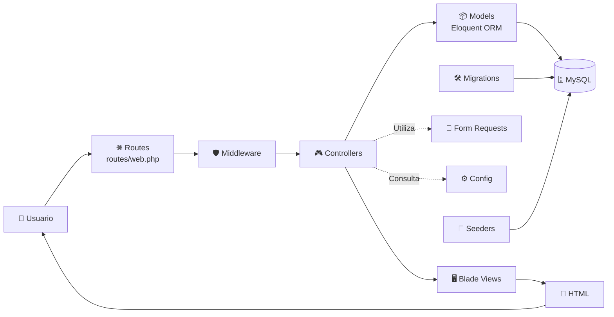

# 🏛️ Arquitectura MVC

> [!info]
> **Proyecto:** Rincón del Pan  
> **Framework:** Laravel Framework 13.23.0  
> **Lenguaje:** PHP 8.3.32  
> **Patrón Arquitectónico:** Modelo - Vista - Controlador (MVC)

---

# Objetivo

Este diagrama representa la arquitectura general de **Rincón del Pan**, desarrollada siguiendo el patrón **Modelo–Vista–Controlador (MVC)** propuesto por Laravel.

Su propósito es mostrar el flujo de una solicitud desde que un usuario interactúa con la aplicación hasta que se genera la respuesta HTML correspondiente.

Este diagrama complementa la explicación desarrollada en [01_Arquitectura](../docs/01_Arquitectura.md).

---

# Diagrama



---

# Descripción del Flujo

El procesamiento de una solicitud dentro del sistema sigue las siguientes etapas:

1. El usuario realiza una petición desde el navegador.
2. Laravel identifica la ruta correspondiente en `routes/web.php`.
3. Los **Middleware** verifican la autenticación y los permisos antes de permitir el acceso.
4. El **Controller** recibe la solicitud, coordina la lógica de negocio y procesa la información.
5. Cuando es necesario acceder a datos persistentes, el controlador utiliza los **Models**, que interactúan con la base de datos mediante **Eloquent ORM**.
6. Las validaciones específicas de formularios pueden delegarse a **Form Requests**.
7. El controlador obtiene los datos necesarios y los envía a una **Vista Blade**.
8. Blade genera el HTML que finalmente se devuelve al navegador.

---

# Componentes

## 👤 Usuario

Representa al actor que interactúa con el sistema mediante un navegador web.

Puede tratarse de:

- Cliente
- Administrador

---

## 🌐 Routes

Las rutas definen los puntos de entrada de la aplicación.

Su función consiste en asociar una URL con el controlador responsable de procesar la solicitud.

Archivo principal:

```text
routes/web.php
```

---

## 🛡️ Middleware

Los Middleware interceptan las solicitudes HTTP antes de llegar al controlador.

Entre sus responsabilidades se encuentran:

- Verificar autenticación.
- Validar permisos.
- Restringir el acceso al panel administrativo.

---

## 🎮 Controllers

Los controladores implementan la lógica de aplicación.

Sus responsabilidades incluyen:

- Recibir solicitudes HTTP.
- Validar información.
- Coordinar la lógica de negocio.
- Consultar modelos.
- Seleccionar la vista correspondiente.

---

## 📦 Models

Los modelos representan las entidades del dominio.

La persistencia se implementa mediante **Eloquent ORM**, permitiendo trabajar con objetos en lugar de consultas SQL directas.

Los principales modelos del proyecto son:

- User
- Address
- Category
- Product
- Order
- OrderItem
- Review
- Wishlist *(utilizada funcionalmente como carrito de compras)*

---

## 🗄️ Base de Datos

Toda la información se almacena en una base de datos **MySQL**.

La estructura se administra mediante:

- Migraciones.
- Seeders.
- Relaciones implementadas con Eloquent ORM.

---

## 🖥️ Blade Views

Blade es el motor de plantillas utilizado por Laravel.

Permite:

- Reutilizar layouts.
- Crear componentes.
- Organizar vistas.
- Separar la presentación de la lógica de negocio.

---

## 📄 Form Requests

Las validaciones de formularios pueden implementarse mediante **Form Requests**, manteniendo los controladores más organizados y favoreciendo la reutilización de reglas de validación.

---

## ⚙️ Configuración

Laravel centraliza la configuración del sistema mediante:

- Archivos ubicados en `config/`.
- Variables definidas en `.env`.

Esto permite desacoplar la configuración del código fuente.

---

## 🛠️ Migraciones

Las migraciones permiten construir la estructura completa de la base de datos desde cero.

Facilitan el versionado del esquema y el trabajo colaborativo.

---

## 🌱 Seeders

Los Seeders generan información inicial para el desarrollo y las pruebas.

Incluyen registros de:

- Usuarios.
- Categorías.
- Productos.
- Direcciones.
- Pedidos.
- Reseñas.
- Carrito de compras.

---

# Características de la Arquitectura

La implementación sigue las recomendaciones oficiales de Laravel:

- Separación clara de responsabilidades.
- Uso de Eloquent ORM.
- Motor de plantillas Blade.
- Middleware para autenticación y autorización.
- Migraciones versionadas.
- Seeders para datos de prueba.
- Configuración mediante variables de entorno.
- Organización modular del proyecto.

---

# Documentación Relacionada

- [01_Arquitectura](../docs/01_Arquitectura.md)
- [02_ModeloDominio](../docs/02_ModeloDominio.md)
- [03_BaseDatos](../docs/03_BaseDatos.md)
- [08_ManualTecnico](../docs/08_ManualTecnico.md)

---

# Consideraciones Finales

La arquitectura implementada en **Rincón del Pan** adopta el patrón **Modelo–Vista–Controlador (MVC)** propuesto por Laravel, promoviendo una estructura organizada, mantenible y escalable.

La separación entre rutas, middleware, controladores, modelos, vistas y base de datos facilita la evolución del proyecto y permite incorporar nuevas funcionalidades respetando las buenas prácticas del framework.
