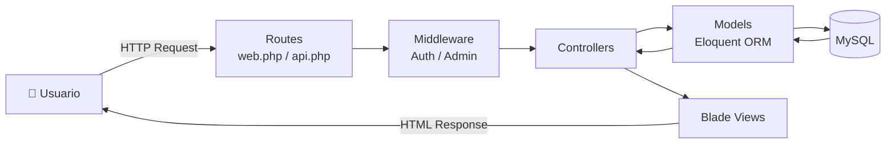

# 🏛️ Arquitectura MVC

> [!info]
> Diagrama general de la arquitectura utilizada por **Sweet Store**.
>
> Documento relacionado:
> - [[01_Arquitectura]]

---

# Descripción

El proyecto fue desarrollado utilizando el patrón **Modelo - Vista - Controlador (MVC)** implementado por Laravel.

El siguiente diagrama representa el flujo principal de una solicitud HTTP dentro de la aplicación.

---

---

# Flujo

1. El usuario realiza una solicitud HTTP.
2. Laravel resuelve la ruta correspondiente.
3. Se ejecutan los Middleware asociados.
4. El Controller procesa la solicitud.
5. El Model interactúa con MySQL mediante Eloquent ORM.
6. El Controller retorna una vista Blade.
7. Laravel genera la respuesta HTML para el navegador.