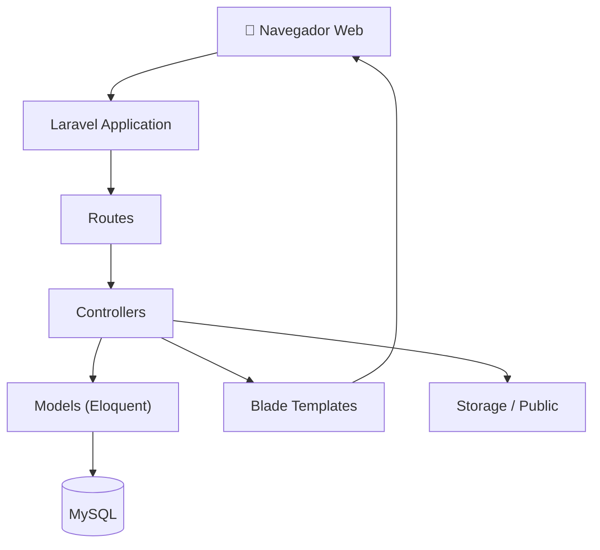

# 🧩 Diagrama de Componentes

> [!info]
> Componentes principales del sistema Rincón del Pan.
>
> Documento relacionado:
> - [[01_Arquitectura]]

---

# Descripción

Este diagrama representa los principales componentes del sistema y las dependencias existentes entre ellos.

---

---

# Componentes

## Navegador

Interfaz utilizada por clientes y administradores.

## Laravel

Framework principal del proyecto.

## Routes

Gestionan el direccionamiento de las solicitudes HTTP.

## Controllers

Implementan la lógica de la aplicación.

## Models

Representan las entidades del dominio utilizando Eloquent ORM.

## Blade

Motor de plantillas encargado de generar las vistas HTML.

## MySQL

Persistencia de la información del sistema.

## Storage

Almacenamiento de imágenes y archivos públicos.
