# 🧩 Componentes del Sistema

> [!info]
> **Proyecto:** Rincón del Pan  
> **Framework:** Laravel Framework 13.23.0  
> **Lenguaje:** PHP 8.3.32

---

# Objetivo

Este diagrama representa los principales componentes que conforman la aplicación **Rincón del Pan** y la forma en que interactúan entre sí.

A diferencia del diagrama de Arquitectura MVC, este documento ofrece una visión de alto nivel de los módulos funcionales del sistema.

Complementa la documentación desarrollada en:

- [01_Arquitectura](../docs/01_Arquitectura.md)
- [08_ManualTecnico](../docs/08_ManualTecnico.md)

---

# Diagrama

```mermaid
flowchart LR

    U["👤 Usuario"]

    subgraph Frontend
        B["🖥️ Blade Templates"]
        BS["🎨 Bootstrap"]
        V["âš¡ Vite"]
    end

    subgraph Backend
        R["🌐 Routes"]
        MW["🛡️ Middleware"]
        C["🎮 Controllers"]
        M["📦 Models"]
        E["🔗 Eloquent ORM"]
    end

    subgraph Persistencia
        DB[("🗄️ MySQL")]
        MIG["🛠️ Migrations"]
        SD["🌱 Seeders"]
    end

    U --> B
    B --> BS
    B --> V

    B --> R

    R --> MW
    MW --> C
    C --> M
    M --> E
    E --> DB

    MIG --> DB
    SD --> DB
```

---

# Descripción General

La aplicación se encuentra organizada en tres grandes bloques:

- Front-End
- Back-End
- Persistencia

Cada uno posee responsabilidades claramente definidas, favoreciendo la separación de responsabilidades y el mantenimiento del proyecto.

---

# Componentes

## 👤 Usuario

Representa al cliente o administrador que interactúa con el sistema mediante un navegador web.

Todas las acciones comienzan a partir de una solicitud realizada por el usuario.

---

## 🖥️ Blade Templates

Las vistas fueron desarrolladas utilizando **Blade**, el motor de plantillas oficial de Laravel.

Responsabilidades:

- Mostrar información.
- Renderizar formularios.
- Reutilizar layouts.
- Organizar componentes visuales.

---

## 🎨 Bootstrap

Framework CSS utilizado para construir la interfaz gráfica.

Permite:

- Diseño responsive.
- Componentes reutilizables.
- Consistencia visual.

---

## âš¡ Vite

Administrador de recursos estáticos utilizado por Laravel.

Se encarga de:

- Compilar CSS.
- Compilar JavaScript.
- Optimizar recursos.
- Recarga automática durante el desarrollo.

---

## 🌐 Routes

Definen las rutas disponibles de la aplicación.

Las solicitudes HTTP ingresan por este componente antes de ser derivadas al controlador correspondiente.

---

## 🛡️ Middleware

Interceptan las solicitudes HTTP antes de llegar al controlador.

Implementan:

- Autenticación.
- Autorización.
- Restricción de acceso según el rol.

---

## 🎮 Controllers

Coordinan la lógica de la aplicación.

Entre sus responsabilidades se encuentran:

- Procesar solicitudes.
- Consultar modelos.
- Validar información.
- Retornar vistas.

---

## 📦 Models

Representan las entidades del dominio utilizando **Eloquent ORM**.

Principales modelos:

- User
- Product
- Category
- Order
- OrderItem
- Review
- Address
- Wishlist *(utilizada como carrito de compras)*

---

## 🔗 Eloquent ORM

Capa de persistencia proporcionada por Laravel.

Permite:

- Consultar registros.
- Gestionar relaciones.
- Crear objetos.
- Actualizar información.
- Eliminar registros.

Todo ello sin necesidad de escribir consultas SQL manuales.

---

## 🗄️ MySQL

Motor de base de datos utilizado para almacenar toda la información del sistema.

La estructura se encuentra completamente versionada mediante migraciones.

---

## 🛠️ Migrations

Definen el esquema de la base de datos.

Permiten:

- Crear tablas.
- Modificar estructuras.
- Versionar cambios.
- Reconstruir el esquema completo.

---

## 🌱 Seeders

Generan información inicial para facilitar el desarrollo y las pruebas.

Incluyen datos de ejemplo para:

- Usuarios.
- Productos.
- Categorías.
- Pedidos.
- Direcciones.
- Reseñas.
- Carrito de compras.

---

# Flujo General

El funcionamiento de la aplicación puede resumirse de la siguiente manera:

1. El usuario interactúa con la interfaz.
2. Blade envía la solicitud.
3. Laravel resuelve la ruta correspondiente.
4. El Middleware valida permisos.
5. El Controller ejecuta la lógica.
6. Los Models consultan la base de datos mediante Eloquent.
7. La información regresa al Controller.
8. Blade genera la respuesta HTML.
9. El navegador presenta el resultado al usuario.

---

# Relación con la Arquitectura

Este diagrama representa una vista lógica de los principales componentes del sistema.

Mientras que:

- [diagramas/01_ArquitecturaMVC](01_ArquitecturaMVC.md)

describe el patrón MVC,

este documento muestra cómo se relacionan los distintos módulos que conforman la aplicación.

---

# Documentación Relacionada

- [01_Arquitectura](../docs/01_Arquitectura.md)
- [08_ManualTecnico](../docs/08_ManualTecnico.md)
- [diagramas/01_ArquitecturaMVC](01_ArquitecturaMVC.md)
- [diagramas/03_Deployment](03_Deployment.md)

---

# Consideraciones Finales

El proyecto **Rincón del Pan** se apoya en los componentes principales del ecosistema Laravel para construir una aplicación modular y organizada.

La integración entre Blade, Bootstrap, Vite, Middleware, Controladores, Modelos, Eloquent ORM y MySQL permite implementar una arquitectura consistente, fácilmente mantenible y alineada con las buenas prácticas recomendadas por el framework.

