# 🚀 Deployment

> [!info]
> **Proyecto:** Rincón del Pan  
> **Framework:** Laravel Framework 13.23.0  
> **Lenguaje:** PHP 8.3.32

---

# Objetivo

Este documento representa el diagrama de despliegue (Deployment Diagram) del proyecto **Rincón del Pan**.

Su finalidad es mostrar cómo se distribuyen los distintos componentes del sistema dentro del entorno de ejecución utilizado durante el desarrollo local.

Este diagrama complementa la información presentada en:

- [09_ManualInstalacion](../docs/09_ManualInstalacion.md)
- [setup-local-dev](../setup-local-dev.md)

---

# Diagrama

```mermaid
flowchart LR

    U["👤 Usuario<br/>Navegador Web"]

    subgraph PC["💻 Equipo de Desarrollo"]
        direction TB

        VSC["📝 Visual Studio Code"]
        GIT["🌿 Git"]
        OBS["📚 Obsidian"]

        subgraph Laravel["⚙️ Laravel 13"]
            PHP["🐘 PHP 8.3"]
            APP["🛒 Aplicación<br/>Rincón del Pan"]
        end

        subgraph Docker["🐳 Docker Desktop"]
            MYSQL["🗄️ MySQL 8"]
            PMA["📊 phpMyAdmin"]
        end
    end

    GH["☁️ GitHub"]

    U --> APP
    APP --> PHP
    PHP --> MYSQL

    PMA --> MYSQL

    VSC --> APP

    GIT --> GH
    GH --> GIT

    OBS -. Documentación .-> APP
```



---

# Descripción General

Durante el desarrollo, todos los componentes de la aplicación se ejecutan sobre un único equipo local.

La aplicación Laravel se comunica con una instancia de **MySQL** ejecutada mediante **Docker Desktop**, mientras que el código fuente es gestionado con **Git** y almacenado en un repositorio remoto de **GitHub**.

La documentación técnica se desarrolla en **Markdown** utilizando **Obsidian**, permitiendo mantenerla versionada junto con el código.

---

# Componentes del Entorno

## 👤 Usuario

Interactúa con la aplicación mediante un navegador web utilizando el servidor de desarrollo integrado de Laravel.

Acceso habitual:

```text
http://127.0.0.1:8000
```

---

## ⚙️ Aplicación Laravel

Implementa toda la lógica de negocio del sistema.

Incluye:

- Rutas
- Middleware
- Controladores
- Modelos
- Vistas Blade
- Migraciones
- Seeders

---

## 🐘 PHP 8.3

Motor encargado de ejecutar la aplicación Laravel.

Versión utilizada durante el desarrollo:

```text
PHP 8.3.32
```

---

## 🐳 Docker Desktop

Se utiliza para aislar los servicios de infraestructura necesarios para el proyecto.

Permite ejecutar los contenedores de manera independiente del sistema operativo anfitrión.

---

## 🗄️ MySQL

Motor de base de datos encargado de almacenar toda la información del sistema.

Se ejecuta dentro de un contenedor Docker.

---

## 📊 phpMyAdmin

Herramienta web utilizada para administrar visualmente la base de datos MySQL durante el desarrollo.

Acceso habitual:

```text
http://localhost:8080
```

---

## 📝 Visual Studio Code

Entorno de desarrollo principal utilizado para la implementación del proyecto.

Se emplea para:

- Desarrollo del código.
- Depuración.
- Gestión de extensiones.
- Integración con Git.

---

## 🌿 Git

Sistema de control de versiones utilizado durante todo el desarrollo.

Permite:

- Registrar cambios.
- Trabajar mediante ramas.
- Mantener historial.
- Colaborar entre integrantes del equipo.

---

## ☁️ GitHub

Repositorio remoto donde se almacena el proyecto y toda su documentación.

Incluye:

- Código fuente.
- Diagramas Mermaid.
- Documentación Markdown.
- Historial completo de versiones.

---

## 📚 Obsidian

Herramienta utilizada para la elaboración y mantenimiento de la documentación técnica del proyecto.

Su integración con Markdown y Mermaid facilita:

- Navegación mediante enlaces internos.
- Visualización del grafo documental.
- Edición de diagramas.
- Versionado junto al código.

---

# Flujo de Despliegue

El proceso de ejecución de la aplicación puede resumirse en los siguientes pasos:

1. El desarrollador inicia los contenedores Docker.
2. MySQL queda disponible para Laravel.
3. Laravel se ejecuta mediante el servidor integrado de PHP.
4. El usuario accede desde un navegador web.
5. Laravel procesa la solicitud y consulta la base de datos cuando es necesario.
6. La respuesta HTML es enviada nuevamente al navegador.

---

# Entorno de Desarrollo

El entorno utilizado durante la realización del proyecto está compuesto por:

| Componente | Tecnología |
|------------|------------|
| Sistema Operativo | Windows 11 |
| Framework | Laravel 13.23.0 |
| Lenguaje | PHP 8.3.32 |
| Base de Datos | MySQL 8 |
| Contenedores | Docker Desktop |
| Administración BD | phpMyAdmin |
| IDE | Visual Studio Code |
| Control de Versiones | Git |
| Repositorio Remoto | GitHub |
| Documentación | Obsidian + Markdown + Mermaid |

---

# Relación con la Documentación

Este diagrama complementa los siguientes documentos:

- [09_ManualInstalacion](../docs/09_ManualInstalacion.md)
- [setup-local-dev](../setup-local-dev.md)
- [08_ManualTecnico](../docs/08_ManualTecnico.md)
- [01_Arquitectura](../docs/01_Arquitectura.md)

---

# Consideraciones Finales

El despliegue representado corresponde al entorno de desarrollo utilizado para la construcción de **Rincón del Pan**.

La utilización de **Laravel Framework 13**, **PHP 8.3**, **Docker Desktop**, **MySQL**, **GitHub** y **Obsidian** permitió construir un entorno moderno, reproducible y fácilmente mantenible, donde tanto el código fuente como la documentación evolucionan conjuntamente bajo control de versiones.

