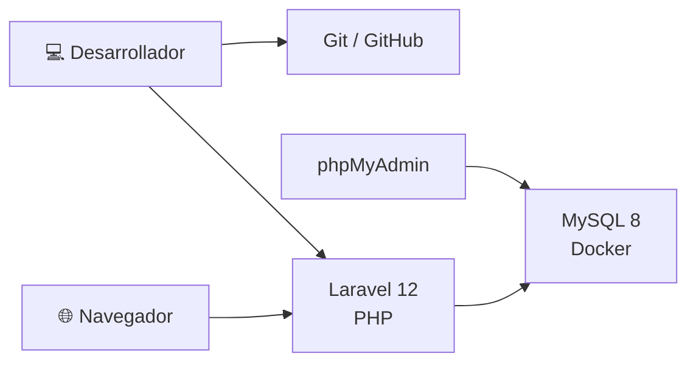

# 🚀 Deployment

> [!info]
> Diagrama del entorno de despliegue utilizado durante el desarrollo.
>
> Documento relacionado:
> - [[09_ManualInstalacion]]

---

# Descripción

El siguiente diagrama representa el entorno de desarrollo utilizado para ejecutar la aplicación localmente.

---



---

# Entorno

Durante el desarrollo del proyecto se utilizó el siguiente stack:

- Windows 11
- Visual Studio Code
- PHP 8
- Composer
- Laravel 12
- Docker WSL
- MySQL 8
- phpMyAdmin
- Git
- GitHub

---

# Despliegue

La aplicación se ejecuta localmente mediante:

```bash
php artisan serve
```

La base de datos se ejecuta mediante:

```bash
docker compose up -d
```

El acceso a la administración de la base de datos se realiza utilizando phpMyAdmin.

La gestión del código fuente se realiza mediante Git y GitHub.