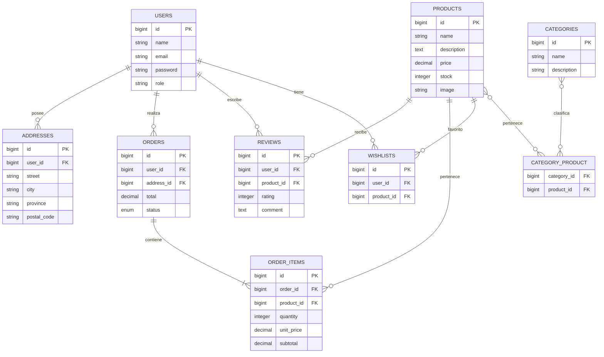

# 🗄️ Diagrama Entidad-Relación (DER)

> [!info]
> Documento relacionado:
> - [[04_DER]]
> - [[10_DiccionarioDatos]]

---

# Descripción

El siguiente diagrama representa el modelo lógico de la base de datos del proyecto **Sweet Store**.

