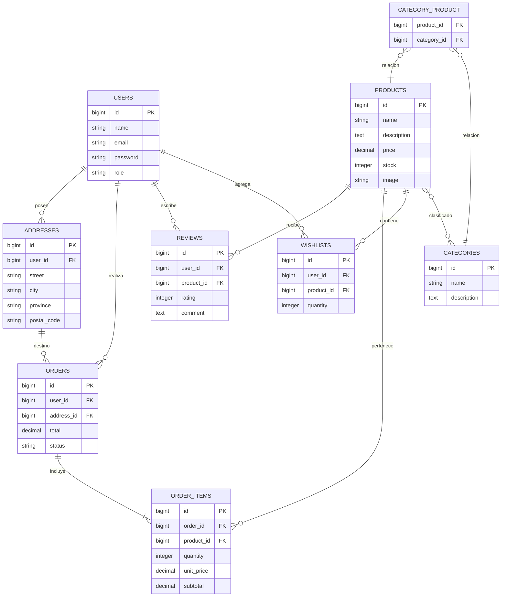

# 🗄️ Diagrama Entidad–Relación (DER)

> [!info]
> **Proyecto:** Rincón del Pan  
> **Framework:** Laravel Framework 13.23.0  
> **Motor de Base de Datos:** MySQL 8

---

# Objetivo

Este documento presenta el **Diagrama Entidad–Relación (DER)** correspondiente a la base de datos del proyecto **Rincón del Pan**.

El diagrama representa la estructura lógica del sistema, mostrando las entidades principales, sus atributos más relevantes y las relaciones existentes entre ellas.

Este modelo fue posteriormente implementado mediante **Laravel Migrations** y administrado utilizando **Eloquent ORM**.

---

# Diagrama

---

# Descripción de las Entidades

## Users

Almacena la información de los usuarios registrados en el sistema.

Incluye tanto clientes como administradores, diferenciados mediante el atributo **role**.

---

## Addresses

Contiene las direcciones de envío asociadas a cada usuario.

Un usuario puede registrar múltiples direcciones.

---

## Categories

Agrupa los productos del catálogo según distintos criterios comerciales.

---

## Products

Representa los productos disponibles para la venta.

Cada producto posee información descriptiva, precio, stock e imagen.

---

## Category_Product

Tabla pivote encargada de implementar la relación **Muchos a Muchos** entre productos y categorías.

Permite que:

- un producto pertenezca a varias categorías;
- una categoría contenga múltiples productos.

---

## Orders

Representa cada compra realizada por un cliente.

Cada pedido mantiene su estado mediante el atributo **status**.

---

## Order_Items

Detalle de productos pertenecientes a un pedido.

Cada registro almacena:

- producto
- cantidad
- precio unitario
- subtotal

---

## Reviews

Permite que los clientes califiquen y comenten productos adquiridos.

Cada reseña pertenece simultáneamente a un usuario y a un producto.

---

## Wishlists

Aunque conserva el nombre **wishlists**, esta entidad fue reutilizada durante el desarrollo para implementar el **carrito de compras** del sistema.

Cada registro representa un producto agregado por un usuario junto con la cantidad seleccionada.

---

# Relaciones Principales

| Relación | Cardinalidad |
|-----------|--------------|
| User → Addresses | 1:N |
| User → Orders | 1:N |
| User → Reviews | 1:N |
| User → Wishlists | 1:N |
| Order → OrderItems | 1:N |
| Product → OrderItems | 1:N |
| Product → Reviews | 1:N |
| Product → Wishlists | 1:N |
| Product ↔ Category | N:M |

---

# Reglas de Negocio Representadas

El modelo contempla las siguientes reglas principales:

- Un usuario puede registrar múltiples direcciones.
- Un usuario puede realizar múltiples pedidos.
- Cada pedido pertenece a una única dirección de envío.
- Un pedido contiene uno o más productos.
- Un producto puede formar parte de múltiples pedidos.
- Un producto puede pertenecer a múltiples categorías.
- Un usuario puede agregar productos al carrito de compras.
- Un usuario puede publicar reseñas sobre productos.

---

# Correspondencia con Laravel

El modelo fue implementado utilizando las siguientes características del framework:

- Laravel Migrations.
- Foreign Keys.
- Eloquent ORM.
- Relaciones `hasMany()`.
- Relaciones `belongsTo()`.
- Relaciones `belongsToMany()`.
- Tabla pivote `category_product`.

---

# Documentación Relacionada

Este diagrama complementa:

- [03_BaseDatos](../docs/03_BaseDatos.md)
- [04_DER](../docs/04_DER.md)
- [10_DiccionarioDatos](../docs/10_DiccionarioDatos.md)
- [diagramas/21_UML_Clases](21_UML_Clases.md)

---

# Consideraciones Finales

El modelo entidad–relación implementado en **Rincón del Pan** constituye la base estructural del sistema, definiendo las entidades necesarias para gestionar usuarios, productos, pedidos, categorías, reseñas, direcciones y el carrito de compras.

Su implementación mediante migraciones y relaciones Eloquent garantiza la integridad referencial de la base de datos y facilita la evolución futura del proyecto.

