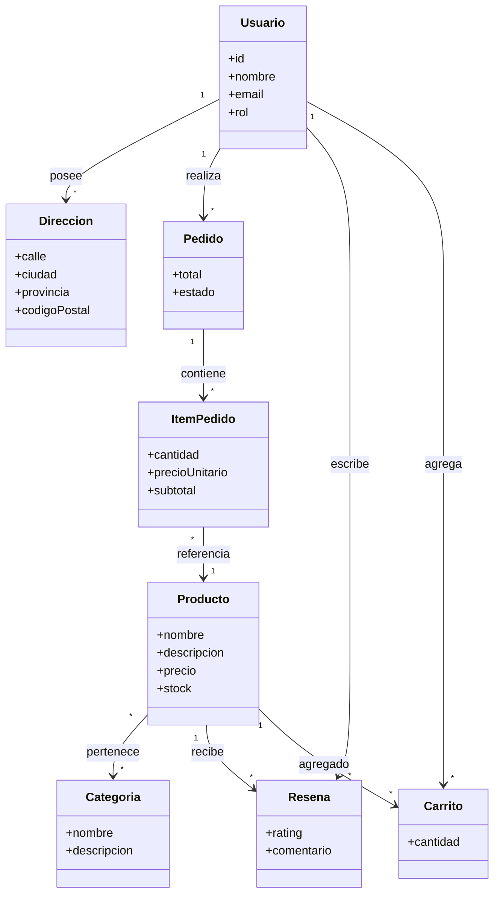

# 🧩 Modelo de Dominio

> [!info]
> **Proyecto:** Rincón del Pan  
> **Framework:** Laravel Framework 13.23.0  
> **Patrón:** Domain Model

---

# Objetivo

Este diagrama representa el **Modelo de Dominio** del proyecto **Rincón del Pan**.

Su finalidad es mostrar las entidades principales del negocio y las relaciones conceptuales entre ellas, independientemente de los detalles de implementación de la base de datos o del framework utilizado.

A diferencia del DER, este modelo se centra en los conceptos del dominio del negocio y cómo colaboran para satisfacer los requisitos funcionales del sistema.

---

# Diagrama

---

# Descripción del Modelo

El dominio de **Rincón del Pan** gira en torno a la gestión de una tienda virtual de productos de panadería y pastelería.

El sistema permite que los clientes exploren el catálogo, seleccionen productos, gestionen un carrito de compras, realicen pedidos y posteriormente puedan dejar reseñas sobre los productos adquiridos.

Por otro lado, los administradores administran el catálogo y supervisan los pedidos generados por los clientes.

---

# Entidades del Dominio

## Usuario

Representa a toda persona registrada dentro del sistema.

Dependiendo de su rol puede actuar como:

- Cliente
- Administrador

Desde esta entidad se originan la mayoría de las operaciones del negocio.

---

## Dirección

Representa una dirección de entrega asociada a un usuario.

Cada cliente puede registrar múltiples direcciones para utilizarlas durante el proceso de compra.

---

## Categoría

Permite organizar los productos del catálogo.

Una categoría puede contener múltiples productos y un producto puede pertenecer a varias categorías.

---

## Producto

Es la entidad central del catálogo.

Cada producto posee:

- Nombre
- Descripción
- Precio
- Stock disponible
- Imagen

Los productos pueden:

- pertenecer a categorías;
- formar parte de pedidos;
- recibir reseñas;
- agregarse al carrito de compras.

---

## Carrito

Durante la implementación del proyecto se reutilizó la entidad **Wishlist** para representar el carrito de compras.

Cada registro almacena:

- Usuario propietario.
- Producto seleccionado.
- Cantidad.

Este diseño permitió reutilizar la estructura existente sin modificar la lógica general del sistema.

---

## Pedido

Representa una compra realizada por un cliente.

Cada pedido mantiene un estado que describe su ciclo de vida dentro del proceso comercial.

Estados posibles:

- Pendiente
- Pagado
- Enviado
- Entregado
- Cancelado

---

## Item del Pedido

Representa cada producto incluido dentro de un pedido.

Almacena:

- Producto
- Cantidad
- Precio unitario
- Subtotal

Esta entidad permite conservar el historial de precios aun cuando el valor del producto cambie posteriormente.

---

## Reseña

Permite que un cliente califique y comente un producto adquirido.

Cada reseña pertenece simultáneamente a:

- un usuario;
- un producto.

---

# Relaciones del Dominio

Las relaciones principales entre entidades son las siguientes:

| Relación | Tipo |
|----------|------|
| Usuario → Dirección | Uno a Muchos |
| Usuario → Pedido | Uno a Muchos |
| Usuario → Reseña | Uno a Muchos |
| Usuario → Carrito | Uno a Muchos |
| Pedido → ItemPedido | Uno a Muchos |
| ItemPedido → Producto | Muchos a Uno |
| Producto ↔ Categoría | Muchos a Muchos |
| Producto → Reseña | Uno a Muchos |
| Producto → Carrito | Uno a Muchos |

---

# Reglas de Negocio Representadas

El modelo refleja las principales reglas funcionales del sistema:

- Un cliente puede registrar múltiples direcciones.
- Un cliente puede realizar múltiples pedidos.
- Cada pedido pertenece a un único cliente.
- Todo pedido contiene al menos un producto.
- Un producto puede integrar distintos pedidos.
- Un producto puede pertenecer a varias categorías.
- Los clientes pueden agregar productos al carrito antes de confirmar la compra.
- Los clientes pueden publicar reseñas sobre productos adquiridos.
- Los administradores gestionan productos, categorías y pedidos.

---

# Diferencias con el DER

El **Modelo de Dominio** representa los conceptos del negocio y las relaciones entre ellos.

El **Diagrama Entidad–Relación (DER)** incorpora además aspectos específicos de persistencia como:

- claves primarias;
- claves foráneas;
- tablas pivote;
- tipos de datos;
- implementación física de la base de datos.

Por esta razón ambos diagramas son complementarios y cumplen funciones diferentes dentro de la documentación del proyecto.

---

# Documentación Relacionada

Este diagrama complementa:

- [02_ModeloDominio](../docs/02_ModeloDominio.md)
- [03_BaseDatos](../docs/03_BaseDatos.md)
- [04_DER](../docs/04_DER.md)
- [10_DiccionarioDatos](../docs/10_DiccionarioDatos.md)
- [diagramas/21_UML_Clases](21_UML_Clases.md)

---

# Consideraciones Finales

El Modelo de Dominio de **Rincón del Pan** ofrece una visión conceptual del funcionamiento del negocio, identificando las entidades fundamentales y las relaciones que permiten implementar el proceso de compra de un comercio electrónico.

Este modelo constituye el punto de partida para el diseño de la base de datos, la implementación de los modelos Eloquent y el desarrollo de la lógica de negocio siguiendo el patrón MVC propuesto por Laravel.

