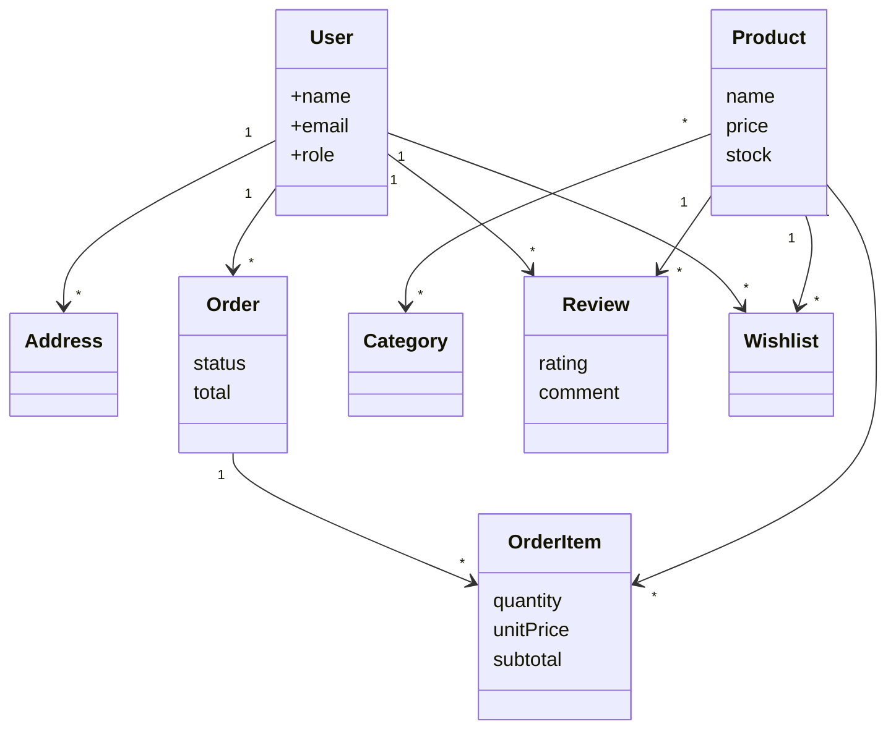

# 🧩 Modelo de Dominio

> [!info]
> Documento relacionado:
> - [[02_ModeloDominio]]

---

# Descripción

El siguiente diagrama representa las entidades principales del dominio de negocio, independientemente de su implementación física en la base de datos.

---

# Observaciones

Este diagrama representa únicamente el dominio funcional del sistema.

No incluye:

- atributos técnicos
- claves primarias
- claves foráneas
- timestamps

Su objetivo es comprender el negocio antes de analizar la implementación.