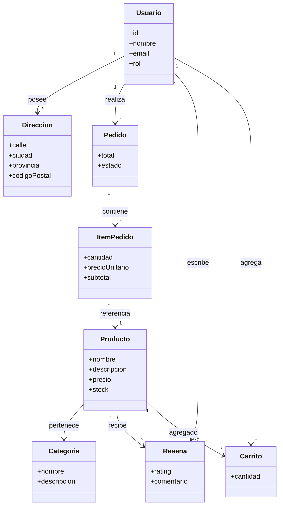

# 🧩 Modelo de Dominio

> [!info]
> **Proyecto:** Rincón del Pan  
> **Framework:** Laravel Framework 13.23.0  
> **Patrón:** Domain Model

---

# Objetivo

Este diagrama representa el **Modelo de Dominio** del proyecto **Rincón del Pan**.

Su finalidad es mostrar las entidades principales del negocio y las relaciones conceptuales entre ellas, independientemente de los detalles de implementación de la base de datos o del framework utilizado.

A diferencia del DER, este modelo se centra en los conceptos del dominio del negocio y cómo colaboran para satisfacer los requisitos funcionales del sistema.

---

# Diagrama

---

# Descripción del Modelo

El dominio de **Rincón del Pan** gira en torno a la gestión de una tienda virtual de productos de panadería y pastelería.

El sistema permite que los clientes exploren el catálogo, seleccionen productos, gestionen un carrito de compras, realicen pedidos y posteriormente puedan dejar reseñas sobre los productos adquiridos.

Por otro lado, los administradores administran el catálogo y supervisan los pedidos generados por los clientes.

---

# Entidades del Dominio

## Usuario

Representa a toda persona registrada dentro del sistema.

Dependiendo de su rol puede actuar como:

- Cliente
- Administrador

Desde esta entidad se originan la mayoría de las operaciones del negocio.

---

## Dirección

Representa una dirección de entrega asociada a un usuario.

Cada cliente puede registrar múltiples direcciones para utilizarlas durante el proceso de compra.

---

## Categoría

Permite organizar los productos del catálogo.

Una categoría puede contener múltiples productos y un producto puede pertenecer a varias categorías.

---

## Producto

Es la entidad central del catálogo.

Cada producto posee:

- Nombre
- Descripción
- Precio
- Stock disponible
- Imagen

Los productos pueden:

- pertenecer a categorías;
- formar parte de pedidos;
- recibir reseñas;
- agregarse al carrito de compras.

---

## Carrito

Durante la implementación del proyecto se reutilizó la entidad **Wishlist** para representar el carrito de compras.

Cada registro almacena:

- Usuario propietario.
- Producto seleccionado.
- Cantidad.

Este diseño permitió reutilizar la estructura existente sin modificar la lógica general del sistema.

---

## Pedido

Representa una compra realizada por un cliente.

El estado del pedido se encuentra controlado mediante un **Enum de Laravel**, permitiendo únicamente los siguientes estados:

- Pending
- Processing
- Sent
- Delivered
- Cancelled

---

## Item del Pedido

Representa cada producto incluido dentro de un pedido.

Almacena:

- Producto
- Cantidad
- Precio unitario
- Subtotal

Esta entidad permite conservar el historial de precios aun cuando el valor del producto cambie posteriormente.

---

## Reseña

Permite que un cliente califique y comente un producto adquirido.

Cada reseña pertenece simultáneamente a:

- un usuario;
- un producto.

---

# Relaciones del Dominio

Las relaciones principales entre entidades son las siguientes:

| Relación | Tipo |
|----------|------|
| Usuario → Dirección | Uno a Muchos |
| Usuario → Pedido | Uno a Muchos |
| Usuario → Reseña | Uno a Muchos |
| Usuario → Carrito | Uno a Muchos |
| Pedido → ItemPedido | Uno a Muchos |
| ItemPedido → Producto | Muchos a Uno |
| Producto ↔ Categoría | Muchos a Muchos |
| Producto → Reseña | Uno a Muchos |
| Producto → Carrito | Uno a Muchos |

---

# Reglas de Negocio Representadas

El modelo refleja las principales reglas funcionales del sistema:

- Un cliente puede registrar múltiples direcciones.
- Un cliente puede realizar múltiples pedidos.
- Cada pedido pertenece a un único cliente.
- Todo pedido contiene al menos un producto.
- Un producto puede integrar distintos pedidos.
- Un producto puede pertenecer a varias categorías.
- Los clientes pueden agregar productos al carrito antes de confirmar la compra.
- Los clientes pueden publicar reseñas sobre productos adquiridos.
- Los administradores gestionan productos, categorías y pedidos.

---

# Diferencias con el DER

El **Modelo de Dominio** representa los conceptos del negocio y las relaciones entre ellos.

El **Diagrama Entidad–Relación (DER)** incorpora además aspectos específicos de persistencia como:

- claves primarias;
- claves foráneas;
- tablas pivote;
- tipos de datos;
- implementación física de la base de datos.

Por esta razón ambos diagramas son complementarios y cumplen funciones diferentes dentro de la documentación del proyecto.

---

# Documentación Relacionada

Este diagrama complementa:

- [02_ModeloDominio](../docs/02_ModeloDominio.md)
- [03_BaseDatos](../docs/03_BaseDatos.md)
- [04_DER](../docs/04_DER.md)
- [10_DiccionarioDatos](../docs/10_DiccionarioDatos.md)
- [21_UML_Clases](./21_UML_Clases.md)

---

# Consideraciones Finales

El Modelo de Dominio de **Rincón del Pan** ofrece una visión conceptual del funcionamiento del negocio, identificando las entidades fundamentales y las relaciones que permiten implementar el proceso de compra de un comercio electrónico.

La representación del ciclo de vida de los pedidos se mantiene alineada con la implementación mediante el **Enum** definido en Laravel, asegurando la correspondencia entre el modelo conceptual y la lógica de negocio desarrollada.

Este modelo constituye el punto de partida para el diseño de la base de datos, la implementación de los modelos Eloquent y el desarrollo de la lógica de negocio siguiendo el patrón MVC propuesto por Laravel.
