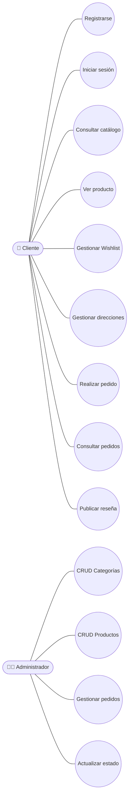

# 👥 UML - Casos de Uso

> [!info]
> Documento relacionado:
> - [[05_CasosUso]]

---

# Descripción

El siguiente diagrama representa las principales funcionalidades disponibles para los actores del sistema.

---

# Actores

## Cliente

Puede:

- Registrarse.
- Iniciar sesión.
- Navegar el catálogo.
- Gestionar Wishlist.
- Gestionar direcciones.
- Realizar pedidos.
- Consultar pedidos.
- Publicar reseñas.

---

## Administrador

Puede:

- Gestionar categorías.
- Gestionar productos.
- Administrar pedidos.
- Actualizar estados.