# 👥 UML - Casos de Uso

> [!info]
> **Proyecto:** Rincón del Pan  
> **Framework:** Laravel Framework 13.23.0  
> **Tipo de Diagrama:** UML - Casos de Uso

---

# Objetivo

Este diagrama representa los principales casos de uso del sistema **Rincón del Pan**, mostrando la interacción entre los distintos actores y las funcionalidades que ofrece la aplicación.

Su finalidad es brindar una visión funcional del sistema antes de analizar aspectos técnicos como la arquitectura o el modelo de datos.

Este documento complementa la información desarrollada en [05_CasosUso](../docs/05_CasosUso.md).

---

# Diagrama

```mermaid
flowchart LR

    Cliente["👤 Cliente"]
    Admin["👨‍💼 Administrador"]

    subgraph Sistema["Rincón del Pan"]

        UC1(("Registrarse"))
        UC2(("Iniciar sesión"))
        UC3(("Ver catálogo"))
        UC4(("Ver producto"))
        UC5(("Gestionar carrito"))
        UC6(("Realizar pedido"))
        UC7(("Consultar pedidos"))
        UC8(("Publicar reseña"))

        UA1(("Gestionar categorías"))
        UA2(("Gestionar productos"))
        UA3(("Gestionar pedidos"))

    end

    Cliente --> UC1
    Cliente --> UC2
    Cliente --> UC3
    Cliente --> UC4
    Cliente --> UC5
    Cliente --> UC6
    Cliente --> UC7
    Cliente --> UC8

    Admin --> UC2
    Admin --> UA1
    Admin --> UA2
    Admin --> UA3
```

---

# Actores

## 👤 Cliente

Representa al usuario registrado que utiliza la tienda para navegar el catálogo y realizar compras.

Puede:

- Registrarse.
- Iniciar sesión.
- Consultar productos.
- Gestionar el carrito de compras.
- Realizar pedidos.
- Consultar pedidos anteriores.
- Publicar reseñas.

---

## 👨‍💼 Administrador

Representa al usuario responsable de administrar el funcionamiento del sistema.

Puede:

- Iniciar sesión.
- Gestionar categorías.
- Gestionar productos.
- Gestionar pedidos.

---

# Casos de Uso

## Registrarse

Permite crear una nueva cuenta de cliente.

Resultado esperado:

- Usuario registrado correctamente.

---

## Iniciar sesión

Autentica al usuario mediante correo electrónico y contraseña.

Una vez autenticado, Laravel crea la sesión correspondiente.

---

## Ver catálogo

Permite consultar los productos disponibles organizados por categorías.

Es la principal funcionalidad pública del sistema.

---

## Ver producto

Muestra la información detallada de un producto.

Incluye:

- Nombre.
- Descripción.
- Precio.
- Imagen.
- Stock disponible.

---

## Gestionar carrito

Permite agregar, modificar o eliminar productos antes de confirmar la compra.

> [!note]
> Técnicamente esta funcionalidad se implementó reutilizando la entidad **Wishlist**, aunque funcionalmente representa el **carrito de compras**.

---

## Realizar pedido

Convierte el contenido del carrito en un pedido.

Durante este proceso el sistema:

- calcula el importe total;
- registra el pedido;
- genera el detalle correspondiente.

---

## Consultar pedidos

Permite visualizar el historial de compras realizadas por el cliente.

---

## Publicar reseña

Permite que un cliente valore un producto adquirido mediante:

- puntuación;
- comentario.

---

## Gestionar categorías

Caso de uso exclusivo del administrador.

Incluye:

- Alta.
- Baja.
- Modificación.
- Consulta.

---

## Gestionar productos

Permite administrar completamente el catálogo de productos.

Incluye:

- creación;
- modificación;
- eliminación;
- actualización de imágenes;
- asignación de categorías.

---

## Gestionar pedidos

Permite al administrador supervisar todos los pedidos registrados y actualizar su estado dentro del flujo operativo.

---

# Alcance del Diagrama

Este diagrama representa únicamente las funcionalidades principales implementadas en el proyecto.

No incluye procesos internos como:

- validaciones;
- middleware;
- autenticación interna;
- consultas a la base de datos;
- renderizado de vistas.

Estos aspectos son desarrollados en los diagramas UML específicos y en la documentación técnica.

---

# Relación con otros Diagramas

Este diagrama sirve como punto de partida para comprender los restantes modelos UML del proyecto:

- [diagramas/21_UML_Clases](21_UML_Clases.md)
- [diagramas/22_UML_SecuenciaLogin](22_UML_SecuenciaLogin.md)
- [diagramas/23_UML_SecuenciaPedido](23_UML_SecuenciaPedido.md)
- [diagramas/24_UML_ActividadCompra](24_UML_ActividadCompra.md)
- [diagramas/25_UML_EstadosPedido](25_UML_EstadosPedido.md)

---

# Documentación Relacionada

- [00_AnalisisRequisitos](../docs/00_AnalisisRequisitos.md)
- [05_CasosUso](../docs/05_CasosUso.md)
- [07_UML](../docs/07_UML.md)

---

# Consideraciones Finales

El diagrama de casos de uso resume las funcionalidades principales de **Rincón del Pan** desde la perspectiva de los actores que interactúan con el sistema.

Constituye una representación de alto nivel del comportamiento esperado de la aplicación y sirve como base para comprender los diagramas UML de clases, secuencia, actividad y estados que documentan con mayor detalle el funcionamiento interno del proyecto.

