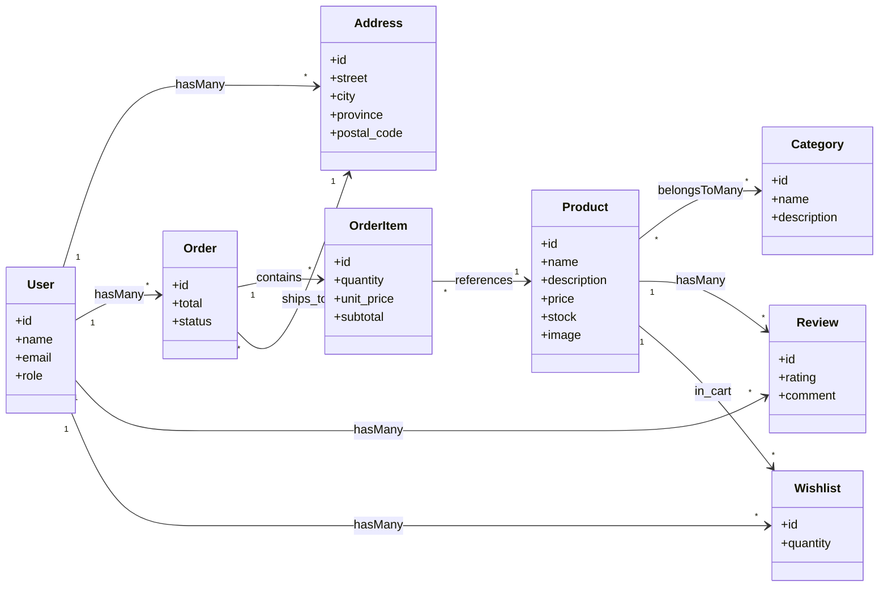

# 🏛️ UML - Diagrama de Clases

> [!info]
> **Proyecto:** Rincón del Pan  
> **Framework:** Laravel Framework 13.23.0  
> **Tipo de Diagrama:** UML - Clases

---

# Objetivo

Este diagrama representa la estructura estática del sistema **Rincón del Pan**, mostrando las principales clases del dominio y las relaciones existentes entre ellas.

Se encuentra basado en los modelos implementados mediante **Eloquent ORM** y constituye la representación UML más importante del proyecto, ya que resume la organización del dominio de negocio y su implementación dentro de Laravel.

---

# Diagrama



---

# Clases Principales

## User

Representa a los usuarios registrados del sistema.

El atributo **role** diferencia:

- Cliente
- Administrador

Desde esta entidad se originan la mayoría de las operaciones del sistema.

---

## Address

Modela las direcciones de envío pertenecientes a un usuario.

Un cliente puede registrar múltiples direcciones para utilizar durante el proceso de compra.

---

## Category

Agrupa los productos del catálogo según distintos criterios comerciales.

Un producto puede pertenecer a múltiples categorías.

---

## Product

Representa los productos disponibles para la venta.

Contiene la información comercial del catálogo:

- nombre;
- descripción;
- precio;
- stock;
- imagen.

Es una de las clases centrales del dominio.

---

## Wishlist

Aunque conserva este nombre por cuestiones de implementación, esta clase representa el **carrito de compras** del sistema.

Cada instancia relaciona:

- un usuario;
- un producto;
- una cantidad seleccionada.

---

## Order

Representa una compra realizada por un cliente.

Cada pedido registra:

- usuario;
- dirección;
- importe total;
- estado.

---

## OrderItem

Representa el detalle de un pedido.

Permite almacenar el precio histórico de cada producto en el momento de la compra.

---

## Review

Representa la valoración realizada por un cliente sobre un producto adquirido.

Incluye:

- puntuación;
- comentario.

---

# Relaciones

| Relación | Multiplicidad |
|-----------|---------------|
| User → Address | 1:N |
| User → Order | 1:N |
| User → Review | 1:N |
| User → Wishlist | 1:N |
| Order → OrderItem | 1:N |
| Order → Address | N:1 |
| Product ↔ Category | N:M |
| Product → Review | 1:N |
| Product → Wishlist | 1:N |
| OrderItem → Product | N:1 |

---

# Correspondencia con Laravel

Cada clase del diagrama corresponde directamente a un **Modelo Eloquent** implementado dentro de:

```text
app/Models/
```

Las asociaciones se implementan mediante:

- `hasMany()`
- `belongsTo()`
- `belongsToMany()`

La relación muchos a muchos entre **Product** y **Category** utiliza la tabla pivote:

```text
category_product
```

---

# Decisiones de Diseño

Durante el desarrollo se adoptaron las siguientes decisiones:

- Uso de **Eloquent ORM** para la persistencia de datos.
- Separación de responsabilidades siguiendo el patrón MVC.
- Implementación de relaciones mediante métodos Eloquent.
- Reutilización de la entidad **Wishlist** para implementar el carrito de compras, evitando duplicar estructuras.
- Gestión del estado de los pedidos mediante un atributo específico (`status`), documentado en el diagrama de estados.

---

# Relación con otros Diagramas

Este diagrama constituye el núcleo de la documentación UML y se complementa con:

- [diagramas/10_DER](docs/diagramas/10_DER].md)
- [diagramas/11_ModeloDominio](docs/diagramas/11_ModeloDominio.md)
- [diagramas/22_UML_SecuenciaLogin](docs/diagramas/22_UML_SecuenciaLogin.md)
- [diagramas/23_UML_SecuenciaPedido](docs/diagramas/23_UML_SecuenciaPedido)
- [diagramas/24_UML_ActividadCompra](docs/diagramas/24_UML_ActividadCompra.md)
- [diagramas/25_UML_EstadosPedido](docs/diagramas/25_UML_EstadosPedido.md)

---

# Documentación Relacionada

- [02_ModeloDominio](docs/docs/02_ModeloDominio.md)
- [03_BaseDatos](docs/docs/03_BaseDatos.md)
- [04_DER](docs/docs/04_DER.md)
- [07_UML](docs/07_UML.md)
- [10_DiccionarioDatos](docs/docs/10_DiccionarioDatos.md)

---

# Consideraciones Finales

El diagrama de clases resume la estructura lógica del proyecto **Rincón del Pan**, mostrando las entidades del dominio implementadas mediante **Laravel Eloquent** y las relaciones que mantienen entre sí.

Su objetivo es facilitar la comprensión de la organización interna del sistema y servir como referencia para futuras tareas de mantenimiento, evolución y ampliación de la aplicación.
