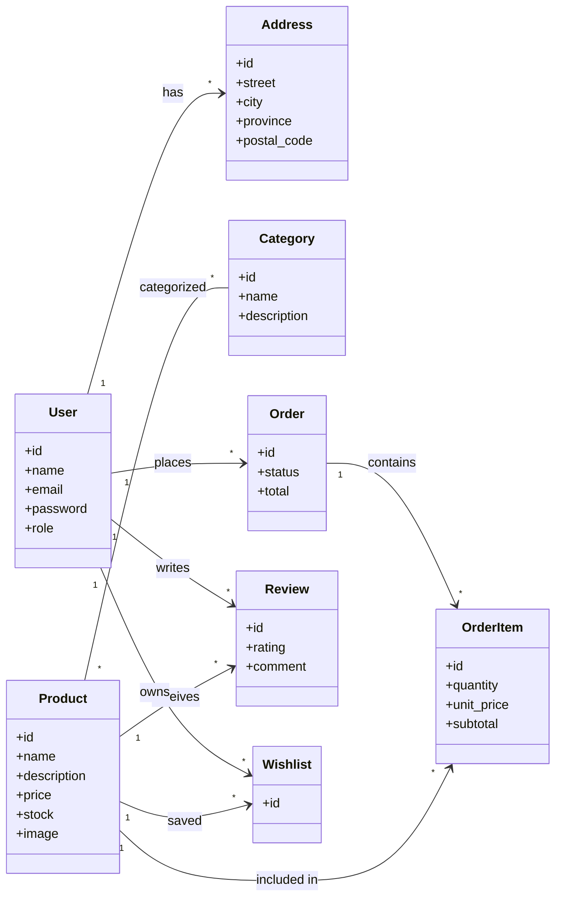

# 📐 UML - Diagrama de Clases

> [!info]
> Documento perteneciente a la documentación del proyecto **Sweet Store**.
>
> Documento relacionado:
> - [[07_UML]]
> - [[02_ModeloDominio]]
> - [[04_DER]]
> - [[10_DiccionarioDatos]]

---

# Introducción

El presente diagrama representa la estructura estática del sistema mediante las clases principales del dominio implementadas con **Laravel Eloquent ORM**.

Su finalidad es mostrar las entidades del negocio, sus atributos más relevantes y las relaciones existentes entre ellas, independientemente de la implementación de la base de datos.

Este diagrama fue construido a partir del código fuente del proyecto.

---

# Diagrama UML

---

# Clases

## User

Representa los usuarios registrados del sistema.

Responsabilidades:

- Autenticación.
- Gestión del perfil.
- Gestión de pedidos.
- Gestión de direcciones.
- Gestión de Wishlist.
- Publicación de reseñas.

---

## Address

Representa una dirección de envío perteneciente a un usuario.

Cada usuario puede registrar múltiples direcciones.

---

## Product

Representa un producto del catálogo.

Incluye información como:

- nombre
- descripción
- precio
- stock
- imagen

Un producto puede pertenecer a múltiples categorías y aparecer en múltiples pedidos.

---

## Category

Permite organizar el catálogo de productos.

Existe una relación muchos a muchos con Product.

---

## Order

Representa una compra realizada por un cliente.

Cada pedido posee:

- estado
- total
- dirección de envío
- detalle de productos

---

## OrderItem

Representa un producto incluido dentro de un pedido.

Almacena:

- cantidad
- precio unitario
- subtotal

---

## Review

Representa una valoración realizada por un cliente.

Cada reseña contiene:

- puntuación
- comentario

---

## Wishlist

Representa la lista de productos favoritos de cada usuario.

Implementa la relación entre usuarios y productos guardados.

---

# Relaciones

| Relación | Cardinalidad |
|----------|--------------|
| User → Address | 1:N |
| User → Order | 1:N |
| Order → OrderItem | 1:N |
| Product → OrderItem | 1:N |
| Product ↔ Category | N:M |
| User → Review | 1:N |
| Product → Review | 1:N |
| User → Wishlist | 1:N |
| Product → Wishlist | 1:N |

---

# Correspondencia con Laravel

Las asociaciones del diagrama se implementan mediante Eloquent ORM utilizando:

- hasMany()
- belongsTo()
- belongsToMany()

Las relaciones muchos a muchos utilizan tablas pivote.

---

# Consideraciones

Este diagrama representa el **modelo de dominio implementado**, por lo tanto puede evolucionar junto con el código fuente.

Las modificaciones realizadas sobre los modelos Eloquent deberán reflejarse en este documento para mantener sincronizada la documentación técnica.

---

## Documentación relacionada

- [[02_ModeloDominio]]
- [[04_DER]]
- [[10_DiccionarioDatos]]