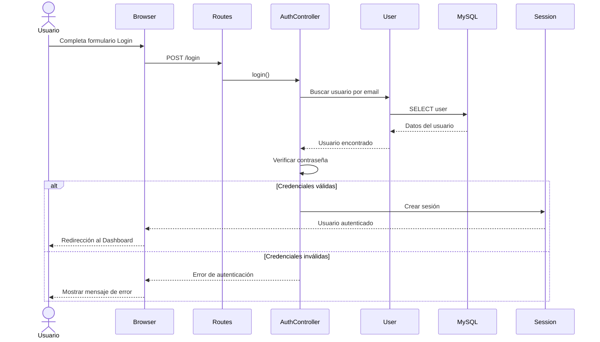

# 🔐 UML - Secuencia de Inicio de Sesión

> [!info]
> Documento perteneciente a la documentación UML del proyecto **Sweet Store**.
>
> Documento relacionado:
> - [[05_CasosUso]]
> - [[08_ManualTecnico]]

---

# Introducción

El siguiente diagrama representa la interacción entre los principales componentes del sistema durante el proceso de autenticación de un usuario.

---

# Diagrama de Secuencia

---

# Flujo

1. El usuario completa el formulario de inicio de sesión.
2. Laravel recibe la solicitud mediante la ruta correspondiente.
3. El controlador consulta el modelo User.
4. Eloquent obtiene la información desde MySQL.
5. Se valida la contraseña.
6. Si las credenciales son correctas se crea la sesión.
7. El usuario es redirigido a la aplicación.

---

# Observaciones

Este flujo representa el comportamiento general implementado mediante autenticación basada en sesiones de Laravel.

Las validaciones específicas pueden evolucionar sin modificar la estructura principal del proceso.

---

## Documentación relacionada

- [[05_CasosUso]]
- [[08_ManualTecnico]]