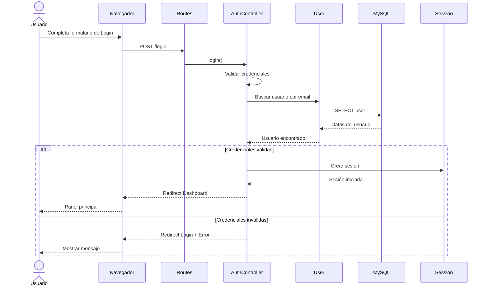

# 🔐 UML - Diagrama de Secuencia: Inicio de Sesión

> [!info]
> **Proyecto:** Rincón del Pan  
> **Framework:** Laravel Framework 13.23.0  
> **Tipo de Diagrama:** UML - Secuencia

---

# Objetivo

Este diagrama describe la interacción entre los distintos componentes del sistema durante el proceso de autenticación de un usuario.

El flujo refleja el funcionamiento implementado mediante el **AuthController**, las rutas de Laravel, el modelo **User**, la base de datos MySQL y el sistema de autenticación basado en sesiones.

Este documento complementa la descripción funcional desarrollada en [05_CasosUso](docs/docs/05_CasosUso.md).

---

# Diagrama

---

# Descripción del Flujo

El proceso de autenticación comienza cuando el usuario completa el formulario de inicio de sesión y envía sus credenciales.

Laravel recibe la solicitud mediante la ruta correspondiente y la deriva al **AuthController**, responsable de validar los datos ingresados y autenticar al usuario.

Si las credenciales son correctas, se crea una sesión y el usuario es redirigido al panel principal.

En caso contrario, el sistema vuelve al formulario de login mostrando un mensaje de error.

---

# Participantes

## 👤 Usuario

Persona que intenta acceder al sistema utilizando su correo electrónico y contraseña.

---

## 🌐 Navegador

Envía la solicitud HTTP y recibe las respuestas generadas por Laravel.

---

## 🛣️ Routes

Resuelven la URL solicitada y derivan la petición al controlador correspondiente.

---

## 🎮 AuthController

Coordina todo el proceso de autenticación.

Sus responsabilidades incluyen:

- Validar datos.
- Buscar el usuario.
- Verificar la contraseña.
- Crear la sesión.
- Redireccionar al usuario.

---

## 📦 User

Modelo Eloquent encargado de representar los usuarios registrados.

Realiza la consulta sobre la base de datos.

---

## 🗄️ MySQL

Almacena la información de los usuarios registrados.

---

## 🔑 Session

Gestiona la autenticación basada en sesiones de Laravel.

Una vez creada la sesión, el usuario puede acceder a las rutas protegidas por el middleware `auth`.

---

# Escenarios Posibles

## Autenticación Exitosa

El sistema:

- encuentra el usuario;
- valida la contraseña;
- crea la sesión;
- redirige al dashboard correspondiente.

---

## Autenticación Fallida

Si las credenciales son incorrectas:

- no se crea ninguna sesión;
- el usuario permanece sin autenticar;
- se muestra un mensaje de error;
- se redirecciona nuevamente al formulario de login.

---

# Relación con Laravel

Durante este proceso intervienen los siguientes componentes del framework:

- Routes
- AuthController
- Middleware `guest`
- Middleware `auth`
- Modelo `User`
- Eloquent ORM
- Sistema de Sesiones
- Blade

---

# Relación con otros Diagramas

Este diagrama se complementa con:

- [diagramas/20_UML_CasosUso](docs/diagramas/20_UML_CasosUso.md)
- [diagramas/21_UML_Clases](docs/diagramas/21_UML_Clases.md)
- [diagramas/23_UML_SecuenciaPedido](docs/diagramas/23_UML_SecuenciaPedido)

---

# Documentación Relacionada

- [05_CasosUso](docs/docs/05_CasosUso.md)
- [[07_UML]]
- [08_ManualTecnico](docs/docs/08_ManualTecnico.md)

---

# Consideraciones Finales

El proceso de autenticación implementado en **Rincón del Pan** sigue el flujo habitual de una aplicación Laravel basada en sesiones.

La separación entre rutas, controlador, modelo, persistencia y gestión de sesiones permite mantener una arquitectura clara y facilita el mantenimiento del sistema, respetando el patrón MVC y las buenas prácticas recomendadas por el framework.
