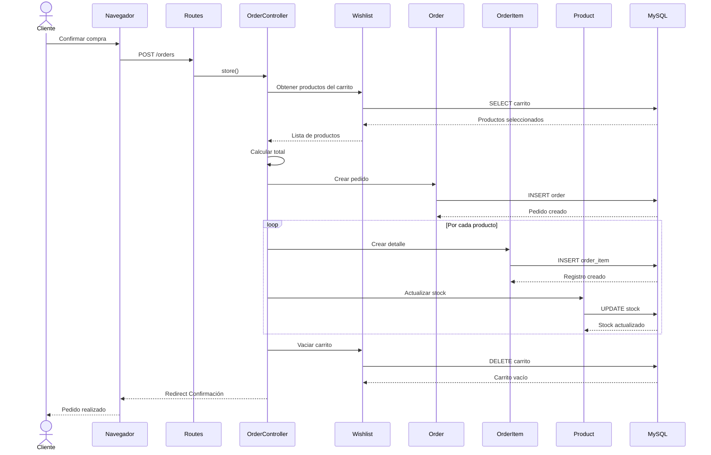

# 🛒 UML - Diagrama de Secuencia: Realizar Pedido

> [!info]
> **Proyecto:** Rincón del Pan  
> **Framework:** Laravel Framework 13.23.0  
> **Tipo de Diagrama:** UML - Secuencia

---

# Objetivo

Este diagrama representa la interacción entre los principales componentes del sistema durante el proceso de creación de un pedido.

El flujo comienza cuando un cliente confirma la compra de los productos agregados al carrito y finaliza cuando el pedido queda registrado en la base de datos con su correspondiente detalle.

Este proceso constituye una de las funcionalidades principales del sistema.

---

# Diagrama

---

# Descripción del Flujo

El proceso comienza cuando el cliente confirma la compra de los productos almacenados en su carrito.

El controlador recupera los productos seleccionados, calcula el importe total del pedido y registra una nueva orden en la base de datos.

Posteriormente genera un registro en **OrderItem** por cada producto adquirido, actualiza el stock disponible y finalmente elimina los productos del carrito.

Una vez completado el proceso, el usuario es redirigido a la pantalla de confirmación.

---

# Participantes

## 👤 Cliente

Usuario autenticado que realiza la compra.

---

## 🌐 Navegador

Envía la solicitud HTTP y presenta la respuesta generada por Laravel.

---

## 🛣️ Routes

Reciben la solicitud y la derivan al controlador correspondiente.

---

## 🎮 OrderController

Coordina todo el proceso de creación del pedido.

Entre sus responsabilidades se encuentran:

- obtener el carrito;
- calcular el total;
- crear el pedido;
- generar el detalle;
- actualizar el stock;
- finalizar la operación.

---

## 🛒 Wishlist

Aunque mantiene este nombre en la implementación, representa el **carrito de compras** del sistema.

Contiene los productos seleccionados por el cliente antes de confirmar la compra.

---

## 📦 Order

Representa el pedido principal generado durante la compra.

Incluye información como:

- cliente;
- dirección;
- estado;
- importe total.

---

## 📄 OrderItem

Representa cada uno de los productos incluidos dentro del pedido.

Cada registro almacena:

- producto;
- cantidad;
- precio unitario;
- subtotal.

---

## 🍞 Product

Modelo encargado de representar los productos del catálogo.

Durante este proceso actualiza el stock disponible luego de registrar la venta.

---

## 🗄️ MySQL

Persistencia de toda la información relacionada con el pedido y sus detalles.

---

# Operaciones Realizadas

Durante el proceso se ejecutan las siguientes acciones principales:

- Recuperar el contenido del carrito.
- Calcular el importe total.
- Crear el pedido.
- Registrar los productos adquiridos.
- Actualizar el stock.
- Vaciar el carrito.
- Confirmar la operación al usuario.

---

# Reglas de Negocio Representadas

El flujo refleja las siguientes reglas del sistema:

- Solo un usuario autenticado puede generar pedidos.
- El pedido debe contener al menos un producto.
- Cada producto genera un registro independiente en **OrderItem**.
- El stock debe actualizarse inmediatamente después de registrar la compra.
- Una vez confirmado el pedido, el carrito queda vacío.

---

# Relación con Laravel

En este proceso participan los siguientes componentes del framework:

- Routes
- Middleware `auth`
- OrderController
- Modelos Eloquent
- Relaciones `hasMany()` y `belongsTo()`
- MySQL

---

# Relación con otros Diagramas

Este diagrama complementa:

- [diagramas/20_UML_CasosUso](docs/diagramas/20_UML_CasosUso.md)
- [diagramas/21_UML_Clases](docs/diagramas/21_UML_Clases.md)
- [diagramas/24_UML_ActividadCompra](docs/diagramas/24_UML_ActividadCompra.md)
- [diagramas/25_UML_EstadosPedido](docs/diagramas/25_UML_EstadosPedido.md)

---

# Documentación Relacionada

- [05_CasosUso](docs/docs/05_CasosUso.md)
- [03_BaseDatos](docs/docs/03_BaseDatos.md)
- [04_DER](docs/docs/04_DER.md)
- [08_ManualTecnico](docs/docs/08_ManualTecnico.md)

---

# Consideraciones Finales

El proceso de creación de pedidos constituye el núcleo funcional de **Rincón del Pan**.

El diagrama muestra cómo colaboran los distintos componentes del sistema para transformar el contenido del carrito de compras en un pedido persistente, manteniendo la consistencia de la información mediante la creación del pedido, sus ítems asociados y la actualización del stock de los productos.
