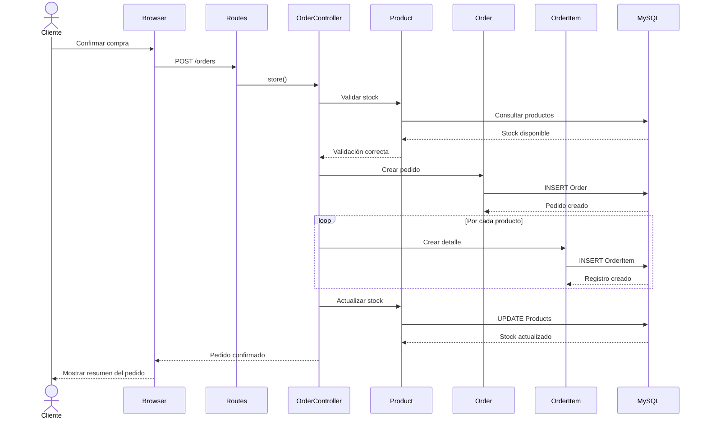

# 🛒 UML - Secuencia: Realizar Pedido

> [!info]
> Documento perteneciente a la documentación UML del proyecto **Rincón del Pan**.
>
> Documento relacionado:
> - [[05_CasosUso]]
> - [[02_ModeloDominio]]
> - [[08_ManualTecnico]]

---

# Introducción

El siguiente diagrama representa la secuencia de eventos que ocurre cuando un cliente realiza un pedido dentro del sistema.

El flujo fue elaborado a partir de la implementación del proyecto y del dominio definido para Rincón del Pan.

---

# Diagrama de Secuencia

---

# Flujo

1. El cliente confirma la compra.
2. Laravel recibe la solicitud.
3. Se valida el stock de cada producto.
4. Se crea el pedido.
5. Se generan los registros de OrderItem.
6. Se actualiza el stock.
7. Se devuelve la confirmación al usuario.

---

# Observaciones

El diagrama representa el comportamiento esperado del proceso de compra dentro del sistema.

Dependiendo de futuras mejoras, podrían incorporarse validaciones adicionales como:

- transacciones de base de datos
- integración con pasarela de pagos
- envío de correos electrónicos
- generación de comprobantes

---

## Documentación relacionada

- [[05_CasosUso]]
- [[02_ModeloDominio]]
- [[08_ManualTecnico]]
