# 🔄 UML - Diagrama de Actividad: Proceso de Compra

> [!info]
> **Proyecto:** Rincón del Pan  
> **Framework:** Laravel Framework 13.23.0  
> **Tipo de Diagrama:** UML - Actividad

---

# Objetivo

Este diagrama representa el flujo completo que sigue un cliente desde que navega por el catálogo de productos hasta que confirma una compra.

A diferencia del diagrama de secuencia, aquí se modelan las **actividades**, **decisiones** y el flujo general del proceso de negocio, sin enfocarse en los componentes internos del sistema.

Este documento complementa la descripción funcional presentada en [05_CasosUso](../docs/05_CasosUso.md) y el flujo técnico detallado en [diagramas/23_UML_SecuenciaPedido](23_UML_SecuenciaPedido.md).

---

# Diagrama

```mermaid
flowchart TD

Inicio([Inicio])

Login[Mostrar pantalla de Login]

Credenciales[Ingresar credenciales]

Validacion{¿Credenciales válidas?}

Catalogo[Mostrar catálogo]

Detalle[Ver detalle del producto]

Agregar[Agregar producto al carrito]

Continuar{¿Continuar comprando?}

Direccion[Seleccionar dirección de envío]

Confirmar[Confirmar pedido]

Procesar[Generar pedido]

Actualizar[Actualizar stock]

Vaciar[Vaciar carrito]

Exito[Mostrar confirmación]

Fin([Fin])

Inicio --> Login

Login --> Credenciales

Credenciales --> Validacion

Validacion -- No --> Login

Validacion -- Sí --> Catalogo

Catalogo --> Detalle

Detalle --> Agregar

Agregar --> Continuar

Continuar -- Sí --> Catalogo

Continuar -- No --> Direccion

Direccion --> Confirmar

Confirmar --> Procesar

Procesar --> Actualizar

Actualizar --> Vaciar

Vaciar --> Exito

Exito --> Fin
```

---

# Descripción del Flujo

El proceso de compra comienza cuando un usuario accede a la aplicación. Como medida de seguridad, la pantalla inicial del sistema corresponde al formulario de inicio de sesión.

Una vez autenticado correctamente, el usuario accede al catálogo de productos, desde donde puede explorar las distintas categorías y consultar el detalle de cada producto disponible.

Al visualizar un producto, el cliente puede agregarlo al carrito de compras y decidir si desea continuar agregando más productos o finalizar la selección.

Cuando decide completar la compra, selecciona una de sus direcciones de envío registradas y confirma el pedido.

Finalmente, el sistema genera el pedido, registra su detalle, actualiza el stock de los productos involucrados, vacía el carrito de compras y muestra una pantalla de confirmación indicando que la operación se realizó correctamente.

---

# Actividades Representadas

El diagrama modela las principales actividades que conforman el proceso de compra:

- Iniciar sesión.
- Validar credenciales.
- Acceder al catálogo.
- Consultar el detalle de un producto.
- Agregar productos al carrito de compras.
- Continuar agregando productos al carrito.
- Seleccionar una dirección de envío.
- Confirmar el pedido.
- Generar el pedido.
- Actualizar el stock de los productos.
- Vaciar el carrito de compras.
- Mostrar la confirmación de la compra.

---

# Decisiones del Proceso

Durante el flujo intervienen dos puntos de decisión principales.

## Validación de credenciales

Al iniciar sesión, el sistema verifica que las credenciales ingresadas sean válidas.

- Si la autenticación falla, el usuario permanece en la pantalla de inicio de sesión.
- Si la autenticación es exitosa, el sistema habilita el acceso al catálogo de productos.

---

## Continuar comprando

Luego de agregar un producto al carrito, el usuario puede decidir:

- Continuar navegando por el catálogo para agregar más productos.
- Finalizar la selección y continuar con el proceso de compra.

---

# Reglas de Negocio Representadas

El diagrama refleja las siguientes reglas del sistema:

- Solo los usuarios autenticados pueden acceder al catálogo.
- Solo los usuarios autenticados pueden realizar pedidos.
- El cliente puede agregar múltiples productos al carrito antes de confirmar la compra.
- Cada pedido requiere la selección de una dirección de envío previamente registrada.
- Al confirmar la compra, el sistema genera automáticamente el pedido y su detalle.
- El stock de los productos se actualiza inmediatamente después de registrar el pedido.
- Una vez completada la compra, el carrito queda vacío.

---

# Relación con Laravel

Este flujo involucra principalmente los siguientes componentes del framework:

- Sistema de autenticación basado en sesiones.
- Middleware `auth`.
- Rutas Web.
- Controladores.
- Modelos Eloquent.
- Vistas Blade.
- Base de datos MySQL.

---

# Relación con otros Diagramas

Este diagrama complementa:

- [diagramas/20_UML_CasosUso](20_UML_CasosUso.md)
- [diagramas/21_UML_Clases](21_UML_Clases.md)
- [diagramas/22_UML_SecuenciaLogin](22_UML_SecuenciaLogin.md)
- [diagramas/23_UML_SecuenciaPedido](23_UML_SecuenciaPedido.md)
- [diagramas/25_UML_EstadosPedido](25_UML_EstadosPedido.md)

---

# Documentación Relacionada

- [05_CasosUso](../docs/05_CasosUso.md)
- [08_ManualTecnico](../docs/08_ManualTecnico.md)
- [09_ManualInstalacion](../docs/09_ManualInstalacion.md)

---

# Consideraciones Finales

El diagrama de actividad describe el proceso completo de compra implementado en **Rincón del Pan**, comenzando con la autenticación obligatoria del usuario y finalizando con la generación del pedido.

Su objetivo es representar el flujo funcional del sistema desde la perspectiva del usuario, mostrando las actividades, decisiones y reglas de negocio involucradas en una compra típica, manteniendo coherencia con la implementación desarrollada en Laravel.

