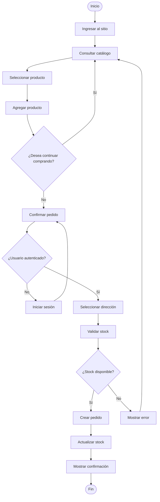

# 🔄 UML - Diagrama de Actividad: Compra de Productos

> [!info]
> Documento perteneciente a la documentación UML del proyecto **Sweet Store**.
>
> Documento relacionado:
> - [[05_CasosUso]]

---

# Introducción

El siguiente diagrama representa el flujo general de actividades que realiza un cliente desde que accede al catálogo hasta la confirmación de un pedido.

---

# Diagrama de Actividad

---

# Descripción

El proceso contempla:

- navegación del catálogo
- selección de productos
- autenticación del usuario
- validación de stock
- creación del pedido
- actualización del inventario

---

# Observaciones

Este flujo representa la operación principal del sistema desde la perspectiva del cliente.

No contempla procesos externos como pagos electrónicos o envíos, ya que dichos componentes quedaron fuera del alcance del proyecto.

---

## Documentación relacionada

- [[05_CasosUso]]
- [[02_ModeloDominio]]