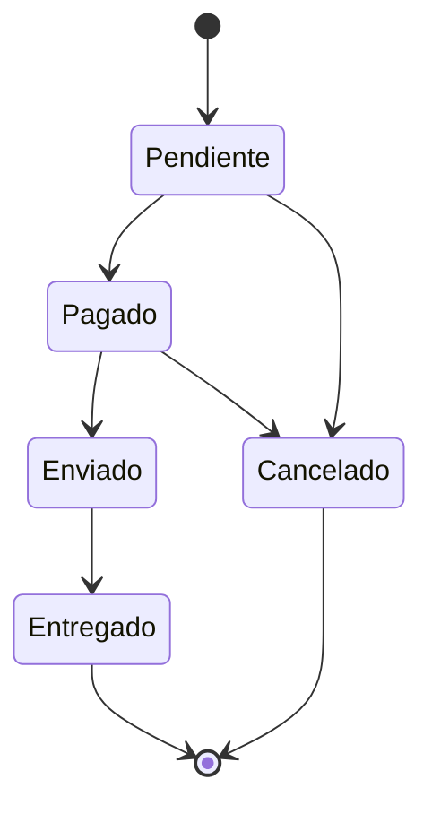

# 📦 UML - Diagrama de Estados del Pedido

> [!info]
> Documento perteneciente a la documentación UML del proyecto **Rincón del Pan**.
>
> Documento relacionado:
> - [[03_BaseDatos]]
> - [[10_DiccionarioDatos]]

---

# Introducción

Los pedidos del sistema poseen un ciclo de vida definido mediante distintos estados.

Este diagrama representa las transiciones permitidas para un pedido durante su procesamiento.

---

# Diagrama de Estados

---

# Estados

## Pendiente

Estado inicial del pedido.

El cliente realizó la compra pero todavía no fue procesada.

---

## Pagado

El pedido fue confirmado y aprobado para continuar con su preparación.

---

## Enviado

Los productos fueron despachados al cliente.

---

## Entregado

El pedido llegó correctamente a destino.

Es el estado final del flujo normal.

---

## Cancelado

Representa un pedido cancelado antes del envío.

Una vez alcanzado este estado, el pedido no puede continuar el flujo normal.

---

# Reglas de Negocio

Se consideran válidas únicamente las siguientes transiciones:

| Estado actual | Estado siguiente |
|---------------|------------------|
| Pendiente | Pagado |
| Pendiente | Cancelado |
| Pagado | Enviado |
| Pagado | Cancelado |
| Enviado | Entregado |

No deben permitirse transiciones que alteren el flujo lógico del proceso.

Ejemplos de transiciones inválidas:

- Pendiente → Entregado
- Enviado → Pendiente
- Cancelado → Pagado
- Entregado → Pendiente

Estas reglas pueden implementarse mediante validaciones en la capa de negocio para preservar la consistencia del sistema.

---

## Documentación relacionada

- [[03_BaseDatos]]
- [[10_DiccionarioDatos]]
- [[08_ManualTecnico]]
