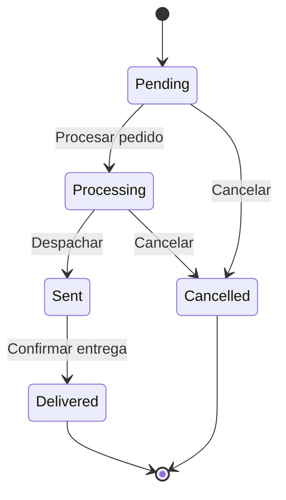

# 🔄 UML - Diagrama de Estados: Pedido

> [!info]
> **Proyecto:** Rincón del Pan  
> **Framework:** Laravel Framework 13.23.0  
> **Tipo de Diagrama:** UML - Máquina de Estados

---

# Objetivo

Este diagrama representa el ciclo de vida de un **Pedido** dentro del sistema **Rincón del Pan**.

Permite visualizar los distintos estados por los que atraviesa un pedido desde su creación hasta su finalización, mostrando las transiciones válidas definidas para el proceso de negocio.

Este modelo se basa en los requisitos establecidos para la materia *Producción Web*, donde se especifica que el estado del pedido debe controlar las transiciones permitidas durante el proceso de compra.

---

# Diagrama



---

# Descripción del Flujo

Todo pedido comienza en estado **Pending**, inmediatamente después de que el cliente confirma la compra.

Una vez que el pedido es aceptado para su preparación, pasa al estado **Processing**, indicando que está siendo procesado por el sistema.

Posteriormente el pedido es despachado, cambiando al estado **Sent**.

Finalmente, cuando el cliente recibe la mercadería, el pedido alcanza el estado **Delivered**, concluyendo su ciclo de vida.

Mientras el pedido aún no haya sido enviado, puede cancelarse, pasando al estado **Cancelled**.

---

# Estados del Pedido

## Pending

Estado inicial del pedido.

Características:

- Pedido recientemente generado.
- Pendiente de procesamiento.
- Puede cancelarse.

---

## Processing

El pedido está siendo preparado para su despacho.

Características:

- Pedido en procesamiento.
- Puede cancelarse mientras no haya sido enviado.

---

## Sent

El pedido fue despachado.

Características:

- Se encuentra en proceso de entrega.
- Ya no admite cancelaciones.

---

## Delivered

Estado final del proceso.

Características:

- El cliente recibió correctamente el pedido.
- El ciclo de vida del pedido finaliza.

---

## Cancelled

Representa un pedido cancelado antes de su entrega.

Características:

- Finaliza el proceso.
- No continúa hacia otros estados.

---

# Transiciones Permitidas

| Estado Actual | Estado Siguiente |
|----------------|------------------|
| Pending | Processing |
| Pending | Cancelled |
| Processing | Sent |
| Processing | Cancelled |
| Sent | Delivered |

---

# Transiciones No Permitidas

Para mantener la consistencia del negocio, el sistema no permite transiciones como:

- Pending → Sent
- Pending → Delivered
- Processing → Pending
- Sent → Processing
- Delivered → Pending
- Cancelled → Processing
- Cancelled → Sent
- Delivered → Cancelled

Estas restricciones garantizan que el pedido siga un flujo lógico y evitan inconsistencias en la gestión de compras.

---

# Reglas de Negocio Representadas

El diagrama refleja las siguientes reglas:

- Todo pedido comienza en estado **Pending**.
- Un pedido debe pasar por el estado **Processing** antes de ser despachado.
- Un pedido solo puede marcarse como **Sent** una vez finalizado su procesamiento.
- Un pedido entregado finaliza su ciclo de vida.
- Los pedidos solo pueden cancelarse antes de ser enviados.
- No es posible reactivar un pedido cancelado.
- No es posible modificar el estado de un pedido una vez entregado.

---

# Implementación en Laravel

En la implementación del proyecto, el estado del pedido se almacena mediante el atributo:

```text
orders.status
```

El estado del pedido se encuentra controlado mediante un **Enum de Laravel**, permitiendo únicamente las siguientes transiciones:

```text
Pending
Processing
Sent
Delivered
Cancelled
```

La utilización del Enum garantiza la consistencia del ciclo de vida del pedido y evita asignar estados no contemplados por la lógica de negocio.

---

# Relación con otros Diagramas

Este diagrama complementa:

- [20_UML_CasosUso](./20_UML_CasosUso.md)
- [21_UML_Clases](./21_UML_Clases.md)
- [23_UML_SecuenciaPedido](./23_UML_SecuenciaPedido.md)
- [24_UML_ActividadCompra](./24_UML_ActividadCompra.md)

---

# Documentación Relacionada

- [03_BaseDatos](../docs/03_BaseDatos.md)
- [04_DER](../docs/04_DER.md)
- [05_CasosUso](../docs/05_CasosUso.md)
- [08_ManualTecnico](../docs/08_ManualTecnico.md)

---

# Consideraciones Finales

El diagrama de estados modela el ciclo de vida completo de un pedido dentro de **Rincón del Pan**, proporcionando una representación clara de las transiciones válidas entre estados.

La implementación mediante el **Enum `OrderStatus`** mantiene alineada la lógica de negocio con la aplicación desarrollada en Laravel, garantizando que todos los pedidos respeten el flujo **Pending → Processing → Sent → Delivered**, con la posibilidad de cancelación antes del envío.
