# 🔄 UML - Diagrama de Estados: Pedido

> [!info]
> **Proyecto:** Rincón del Pan  
> **Framework:** Laravel Framework 13.23.0  
> **Tipo de Diagrama:** UML - Máquina de Estados

---

# Objetivo

Este diagrama representa el ciclo de vida de un **Pedido** dentro del sistema **Rincón del Pan**.

Permite visualizar los distintos estados por los que atraviesa un pedido desde su creación hasta su finalización, mostrando las transiciones válidas definidas para el proceso de negocio.

Este modelo se basa en los requisitos establecidos para la materia *Desarrollo de Aplicaciones Web con Laravel*, donde se especifica que el estado del pedido debe controlar las transiciones permitidas durante el proceso de compra.

---

# Diagrama

```mermaid
stateDiagram-v2

[*] --> Pendiente

Pendiente --> Pagado : Pago confirmado
Pendiente --> Cancelado : Cancelación

Pagado --> Enviado : Despacho
Pagado --> Cancelado : Cancelación

Enviado --> Entregado : Recepción confirmada

Entregado --> [*]
Cancelado --> [*]
```



---

# Descripción del Flujo

Todo pedido comienza en estado **Pendiente**, inmediatamente después de que el cliente confirma la compra.

Una vez procesado el pago, el pedido pasa al estado **Pagado**, indicando que la operación fue validada correctamente.

Posteriormente el pedido es preparado y despachado, cambiando al estado **Enviado**.

Finalmente, cuando el cliente recibe la mercadería, el pedido alcanza el estado **Entregado**, concluyendo su ciclo de vida.

En cualquier momento anterior al envío, el pedido puede ser cancelado, pasando al estado **Cancelado**.

---

# Estados del Pedido

## Pendiente

Estado inicial del pedido.

Características:

- Pedido recientemente generado.
- Esperando confirmación del pago.
- Puede cancelarse.

---

## Pagado

El pago fue aceptado correctamente.

Características:

- Pedido confirmado.
- Listo para preparación y despacho.
- Aún puede cancelarse si no fue enviado.

---

## Enviado

El pedido fue despachado.

Características:

- Se encuentra en proceso de entrega.
- Ya no admite cancelaciones.

---

## Entregado

Estado final del proceso.

Características:

- El cliente recibió correctamente el pedido.
- El ciclo de vida del pedido finaliza.

---

## Cancelado

Representa un pedido anulado antes del envío.

Características:

- Finaliza el proceso.
- No continúa hacia otros estados.

---

# Transiciones Permitidas

| Estado Actual | Estado Siguiente |
|----------------|------------------|
| Pendiente | Pagado |
| Pendiente | Cancelado |
| Pagado | Enviado |
| Pagado | Cancelado |
| Enviado | Entregado |

---

# Transiciones No Permitidas

Para mantener la consistencia del negocio, el sistema no debería permitir transiciones como:

- Pendiente → Entregado
- Pendiente → Enviado
- Pagado → Pendiente
- Enviado → Pagado
- Entregado → Pendiente
- Cancelado → Pagado
- Cancelado → Enviado
- Entregado → Cancelado

Estas restricciones garantizan que el pedido siga un flujo lógico y evitan inconsistencias en la gestión de compras.

---

# Reglas de Negocio Representadas

El diagrama refleja las siguientes reglas:

- Todo pedido comienza en estado **Pendiente**.
- Un pedido solo puede enviarse después de haber sido pagado.
- Un pedido entregado finaliza su ciclo de vida.
- Los pedidos solo pueden cancelarse antes de ser enviados.
- No es posible reactivar un pedido cancelado.
- No es posible modificar el estado de un pedido una vez entregado.

---

# Implementación en Laravel

En la implementación actual del proyecto, el estado del pedido se almacena mediante el atributo:

```text
orders.status
```

Los valores posibles definidos para este atributo son:

```text
Pendiente
Pagado
Enviado
Entregado
Cancelado
```

La documentación de la materia recomienda implementar este comportamiento mediante un **Enum de Laravel** o una validación estricta en la capa de negocio, evitando transiciones inválidas.

---

# Relación con otros Diagramas

Este diagrama complementa:

- [diagramas/20_UML_CasosUso](20_UML_CasosUso.md)
- [diagramas/21_UML_Clases](21_UML_Clases.md)
- [diagramas/23_UML_SecuenciaPedido](23_UML_SecuenciaPedido.md)
- [diagramas/24_UML_ActividadCompra](24_UML_ActividadCompra.md)

---

# Documentación Relacionada

- [03_BaseDatos](../docs/03_BaseDatos.md)
- [04_DER](../docs/04_DER.md)
- [05_CasosUso](../docs/05_CasosUso.md)
- [08_ManualTecnico](../docs/08_ManualTecnico.md)

---

# Consideraciones Finales

El diagrama de estados modela el ciclo de vida completo de un pedido dentro de **Rincón del Pan**, proporcionando una representación clara de las transiciones válidas entre estados.

Su utilización facilita la comprensión del proceso de gestión de pedidos y sirve como referencia para futuras mejoras, como la incorporación de notificaciones, seguimiento de envíos o automatización de procesos comerciales.

