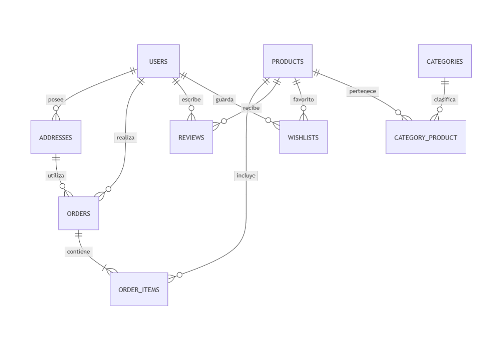

# Diccionario de Datos

# Sweet Store - E-commerce de Pastelería

## Objetivo

El presente documento describe detalladamente la estructura de datos del sistema Sweet Store. Su finalidad es documentar cada entidad, atributo, tipo de dato y restricciones de la base de datos para facilitar el desarrollo, mantenimiento y comprensión del sistema.

---

# Diagrama General de Relaciones


---

# Tabla: users

Descripción: almacena clientes y administradores del sistema.

| Campo | Tipo | Nulo | Descripción |
|---------|---------|---------|---------|
| id | BIGINT | No | Identificador único |
| name | VARCHAR(255) | No | Nombre completo |
| email | VARCHAR(255) | No | Correo electrónico |
| password | VARCHAR(255) | No | Contraseña encriptada |
| role | ENUM | No | Rol del usuario |
| email_verified_at | TIMESTAMP | Sí | Fecha de verificación |
| remember_token | VARCHAR(100) | Sí | Token de sesión |
| created_at | TIMESTAMP | Sí | Fecha de creación |
| updated_at | TIMESTAMP | Sí | Fecha de actualización |

---

# Tabla: addresses

Descripción: direcciones de envío de los usuarios.

| Campo | Tipo | Nulo | Descripción |
|---------|---------|---------|---------|
| id | BIGINT | No | Identificador único |
| user_id | BIGINT | No | Usuario propietario |
| street | VARCHAR(255) | No | Calle y altura |
| city | VARCHAR(100) | No | Ciudad |
| province | VARCHAR(100) | No | Provincia |
| postal_code | VARCHAR(20) | No | Código postal |
| country | VARCHAR(100) | No | País |
| created_at | TIMESTAMP | Sí | Fecha de creación |
| updated_at | TIMESTAMP | Sí | Fecha de actualización |

---

# Tabla: categories

Descripción: categorías que organizan los productos.

| Campo | Tipo | Nulo | Descripción |
|---------|---------|---------|---------|
| id | BIGINT | No | Identificador único |
| name | VARCHAR(100) | No | Nombre de la categoría |
| description | TEXT | Sí | Descripción |
| created_at | TIMESTAMP | Sí | Fecha de creación |
| updated_at | TIMESTAMP | Sí | Fecha de actualización |

---

# Tabla: products

Descripción: productos comercializados en la pastelería.

| Campo | Tipo | Nulo | Descripción |
|---------|---------|---------|---------|
| id | BIGINT | No | Identificador único |
| name | VARCHAR(255) | No | Nombre del producto |
| description | TEXT | No | Descripción detallada |
| price | DECIMAL(10,2) | No | Precio de venta |
| stock | INT | No | Stock disponible |
| image_url | VARCHAR(255) | Sí | Imagen del producto |
| created_at | TIMESTAMP | Sí | Fecha de creación |
| updated_at | TIMESTAMP | Sí | Fecha de actualización |

---

# Tabla: category_product

Descripción: tabla pivote para la relación N:M entre categorías y productos.

| Campo | Tipo | Nulo | Descripción |
|---------|---------|---------|---------|
| category_id | BIGINT | No | Categoría asociada |
| product_id | BIGINT | No | Producto asociado |

---

# Tabla: orders

Descripción: pedidos realizados por los clientes.

| Campo | Tipo | Nulo | Descripción |
|---------|---------|---------|---------|
| id | BIGINT | No | Identificador único |
| user_id | BIGINT | No | Cliente |
| address_id | BIGINT | No | Dirección de envío |
| total | DECIMAL(10,2) | No | Importe total |
| status | ENUM | No | Estado del pedido |
| created_at | TIMESTAMP | Sí | Fecha de creación |
| updated_at | TIMESTAMP | Sí | Fecha de actualización |

Estados válidos:

```text
pendiente
pagado
enviado
entregado
cancelado
```

---

# Tabla: order_items

Descripción: detalle de productos contenidos en cada pedido.

| Campo | Tipo | Nulo | Descripción |
|---------|---------|---------|---------|
| id | BIGINT | No | Identificador único |
| order_id | BIGINT | No | Pedido asociado |
| product_id | BIGINT | No | Producto asociado |
| quantity | INT | No | Cantidad |
| unit_price | DECIMAL(10,2) | No | Precio unitario |
| subtotal | DECIMAL(10,2) | No | Importe parcial |
| created_at | TIMESTAMP | Sí | Fecha de creación |
| updated_at | TIMESTAMP | Sí | Fecha de actualización |

---

# Tabla: reviews

Descripción: opiniones y valoraciones de productos.

| Campo | Tipo | Nulo | Descripción |
|---------|---------|---------|---------|
| id | BIGINT | No | Identificador único |
| user_id | BIGINT | No | Usuario autor |
| product_id | BIGINT | No | Producto reseñado |
| rating | TINYINT | No | Puntuación de 1 a 5 |
| comment | TEXT | No | Comentario |
| created_at | TIMESTAMP | Sí | Fecha de creación |
| updated_at | TIMESTAMP | Sí | Fecha de actualización |

Restricción:

```text
rating entre 1 y 5
```

---

# Tabla: wishlists

Descripción: productos favoritos guardados por los usuarios.

| Campo | Tipo | Nulo | Descripción |
|---------|---------|---------|---------|
| user_id | BIGINT | No | Usuario |
| product_id | BIGINT | No | Producto favorito |
| created_at | TIMESTAMP | Sí | Fecha de agregado |

---

# Resumen de Claves Primarias

```text
users.id
addresses.id
categories.id
products.id
orders.id
order_items.id
reviews.id
```

Claves compuestas:

```text
category_product(category_id, product_id)
wishlists(user_id, product_id)
```

---

# Resumen de Claves Foráneas

```text
addresses.user_id -> users.id
orders.user_id -> users.id
orders.address_id -> addresses.id
order_items.order_id -> orders.id
order_items.product_id -> products.id
reviews.user_id -> users.id
reviews.product_id -> products.id
category_product.category_id -> categories.id
category_product.product_id -> products.id
wishlists.user_id -> users.id
wishlists.product_id -> products.id
```

---

# Conclusión

El diccionario de datos documenta todas las entidades obligatorias del proyecto Sweet Store y sirve como referencia para la implementación de migraciones, modelos Eloquent, validaciones y consultas dentro de Laravel.
