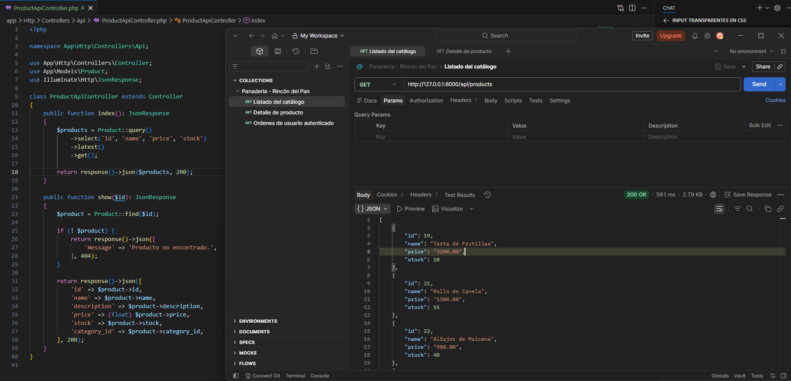
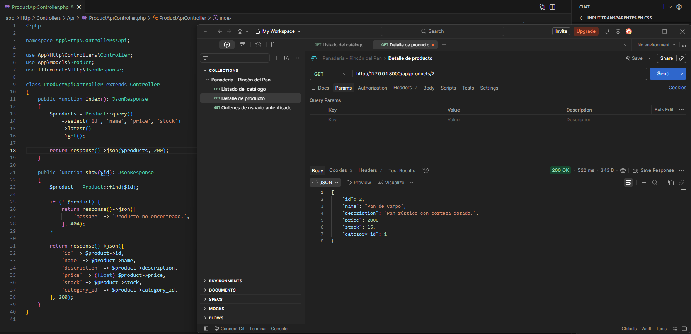
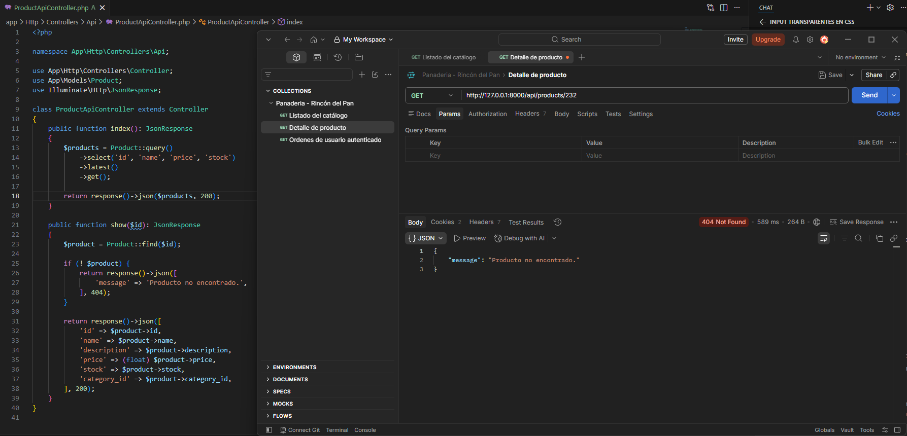
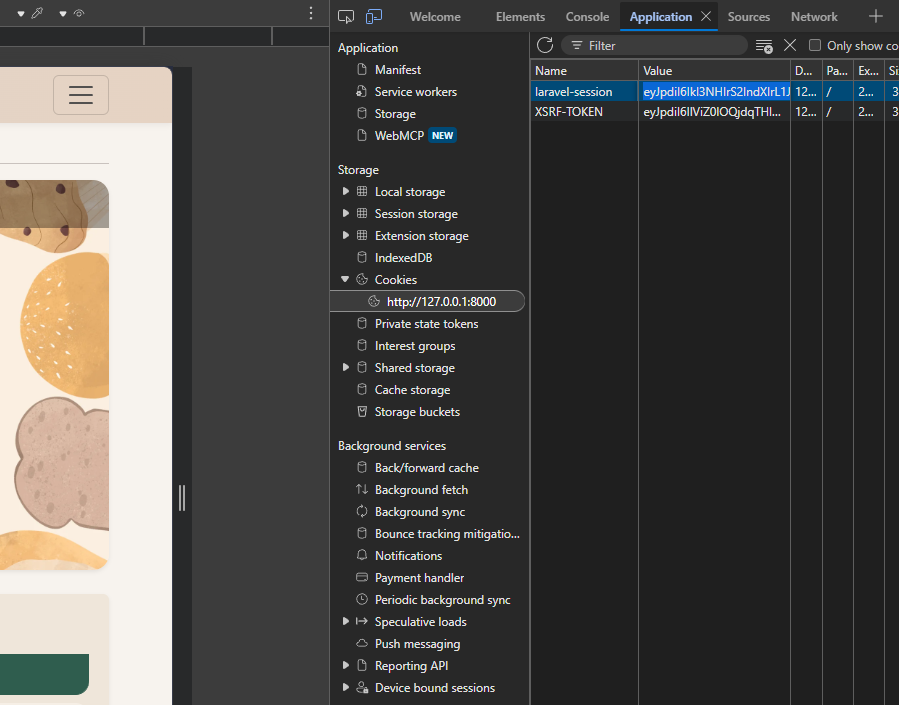
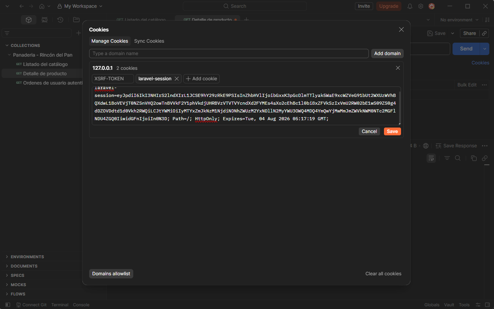
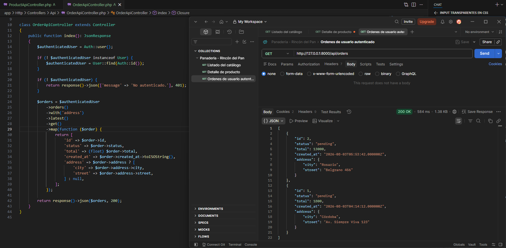
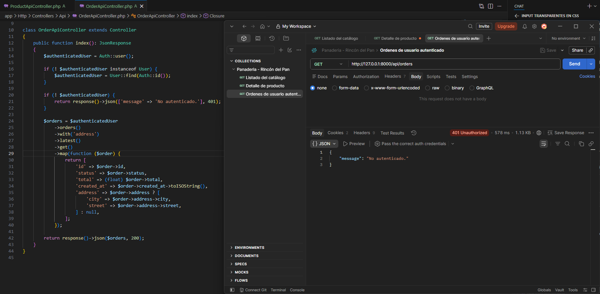

# 🌐 API REST

> [!info]
> **Proyecto:** Rincón del Pan  
> **Materia:** Producción Web  
> **Framework:** Laravel Framework 13.23.0  
> **Lenguaje:** PHP 8.3.32

---

# Introducción

Como componente adicional del Trabajo Final, se desarrolló una API REST con el objetivo de exponer parte de la funcionalidad del sistema mediante respuestas en formato **JSON**, independientemente de las vistas Blade utilizadas por la aplicación web.

La implementación sigue la consigna de la materia, permitiendo comprender la diferencia entre una aplicación tradicional basada en vistas y un servicio orientado al intercambio de datos mediante HTTP.

La API fue desarrollada utilizando las herramientas provistas por Laravel, reutilizando el mismo modelo de datos y la lógica de negocio implementada para la aplicación principal.

---

# Objetivos

Los objetivos de esta implementación fueron:

- Comprender el funcionamiento básico de una API REST.
- Exponer recursos del sistema en formato JSON.
- Reutilizar la lógica de negocio existente.
- Diferenciar respuestas HTML de respuestas JSON.
- Practicar el uso de Postman para el consumo y prueba de endpoints.

---

# Arquitectura

La API se implementó siguiendo la arquitectura MVC de Laravel.

```
Cliente (Postman / Aplicación)

        │

        ▼

routes/api.php

        │

        ▼

ProductApiController

        │

        ▼

Modelos Eloquent

        │

        ▼

MySQL
```

Las rutas reciben las solicitudes HTTP y delegan el procesamiento al controlador correspondiente, el cual consulta los modelos Eloquent y devuelve la información serializada en formato JSON.

---

# Proceso de Implementación

La implementación de la API se realizó siguiendo los siguientes pasos.

## 1. Creación del controlador

Se generó un controlador específico para la API utilizando Artisan.

```bash
php artisan make:controller Api/ProductApiController --api
```

El modificador `--api` crea automáticamente la estructura de un controlador REST con los métodos habituales utilizados por Laravel.

---

## 2. Implementación de la lógica

Se desarrolló la lógica necesaria para consultar los recursos mediante Eloquent y devolver las respuestas en formato JSON.

Los métodos implementados utilizan los modelos existentes del proyecto, evitando duplicar la lógica de acceso a datos.

---

## 3. Definición de rutas

Se creó el archivo:

```text
routes/api.php
```

En este archivo se definieron los endpoints correspondientes a la API REST.

---

## 4. Registro de las rutas

Las rutas API fueron registradas dentro del archivo:

```text
bootstrap/app.php
```

De esta manera Laravel incorpora automáticamente el archivo `api.php` dentro del ciclo de ejecución de la aplicación.

---

## 5. Pruebas funcionales

Las pruebas fueron realizadas mediante **Postman**, verificando:

- respuestas JSON;
- códigos HTTP;
- estructura de los recursos devueltos.

La colección utilizada para las pruebas forma parte de los entregables del proyecto.

---

# Endpoints Implementados

## Obtener catálogo de productos

```http
GET /api/products
```

Descripción:

Obtiene el listado completo de productos disponibles.

Respuesta esperada:

```text
HTTP 200 OK
```

Ejemplo de respuesta:

```json
[
    {
        "id": 1,
        "name": "Pan Integral",
        "price": 1200
    }
]
```

---

## Obtener detalle de un producto

```http
GET /api/products/{id}
```

Descripción:

Obtiene la información detallada de un producto específico.

Respuesta esperada:

```text
HTTP 200 OK
```

Si el producto no existe:

```text
HTTP 404 Not Found
```

Ejemplo:

```json
{
    "id": 3,
    "name": "Torta Rogel",
    "description": "...",
    "price": 8500
}
```

---

## Obtener pedidos del usuario autenticado

```http
GET /api/orders
```

Descripción:

Devuelve los pedidos pertenecientes al usuario autenticado.

Este endpoint reutiliza la autenticación basada en sesión utilizada por la aplicación web, tal como lo establece la consigna del trabajo práctico.

Respuesta esperada:

```text
HTTP 200 OK
```

---

# Códigos HTTP Utilizados

| Código | Descripción |
|---------|-------------|
| 200 | Solicitud procesada correctamente. |
| 404 | Recurso inexistente. |
| 500 | Error interno del servidor. |

---

# Autenticación

La API reutiliza el mecanismo de autenticación implementado por la aplicación web.

No se implementó autenticación mediante tokens (Sanctum o Passport), ya que la consigna del trabajo establece que los endpoints pueden utilizar autenticación basada en sesión.

---

# Pruebas Realizadas

Los endpoints fueron probados utilizando **Postman**, verificando:

- disponibilidad de cada endpoint;
- códigos HTTP devueltos;
- formato JSON de las respuestas;
- estructura de los recursos obtenidos.

La colección exportada de Postman forma parte de la entrega del proyecto.

---

# Evidencias

Las siguientes capturas corresponden a las pruebas realizadas con **Postman** durante la validación de la API REST.

## Endpoint: GET /api/products

**Resultado esperado:** Obtención del catálogo completo de productos.



---

## Endpoint: GET /api/products/{id} - Producto existente

**Resultado esperado:** Obtención del detalle de un producto válido (**HTTP 200 OK**).



---

## Endpoint: GET /api/products/{id} - Producto inexistente

**Resultado esperado:** Respuesta **HTTP 404 Not Found** cuando el identificador no existe.



---

## Autenticación mediante sesión

La API reutiliza la autenticación basada en sesión utilizada por la aplicación web.

### Valor de la sesión en el navegador

Captura obtenida desde las herramientas de desarrollo del navegador mostrando el identificador de sesión generado por Laravel.



---

### Importación de la sesión en Postman

Configuración de la cookie de sesión dentro de Postman para autenticar las solicitudes.



---

## Endpoint: GET /api/orders - Usuario autenticado

**Resultado esperado:** Obtención del listado de pedidos pertenecientes al usuario autenticado (**HTTP 200 OK**).



---

## Endpoint: GET /api/orders - Usuario no autenticado

**Resultado esperado:** Rechazo de la solicitud al no existir una sesión válida (**HTTP 401 Unauthorized** o el código configurado por la aplicación).



---

# Colección Postman

La colección utilizada para validar la API se entrega junto con el proyecto.

Incluye pruebas automáticas (`pm.test(...)`) para verificar el código de estado HTTP de cada endpoint implementado.

---

# Relación con otros Documentos

- [01_Arquitectura](./01_Arquitectura.md)
- [03_BaseDatos](./03_BaseDatos.md)
- [04_DER](./04_DER.md)
- [08_ManualTecnico](./08_ManualTecnico.md)

---

# Diagramas Relacionados

- [diagramas/01_ArquitecturaMVC](../diagramas/01_ArquitecturaMVC.md)
- [diagramas/02_Componentes](../diagramas/02_Componentes.md)
- [diagramas/21_UML_Clases](../diagramas/21_UML_Clases.md)
- [diagramas/23_UML_SecuenciaPedido](../diagramas/23_UML_SecuenciaPedido.md)

---

# Consideraciones Finales

La API REST desarrollada permite acceder a un subconjunto de la información del sistema mediante servicios HTTP que devuelven respuestas JSON.

Su implementación cumple con los objetivos planteados por la materia **Producción Web**, reutilizando la arquitectura MVC de Laravel y la lógica de negocio existente, sin necesidad de duplicar funcionalidades.

Este componente constituye una primera aproximación al desarrollo de servicios REST y sienta las bases para futuras ampliaciones del sistema, como autenticación mediante tokens, operaciones CRUD completas o integración con aplicaciones externas.
